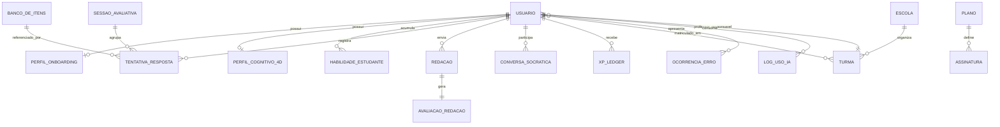
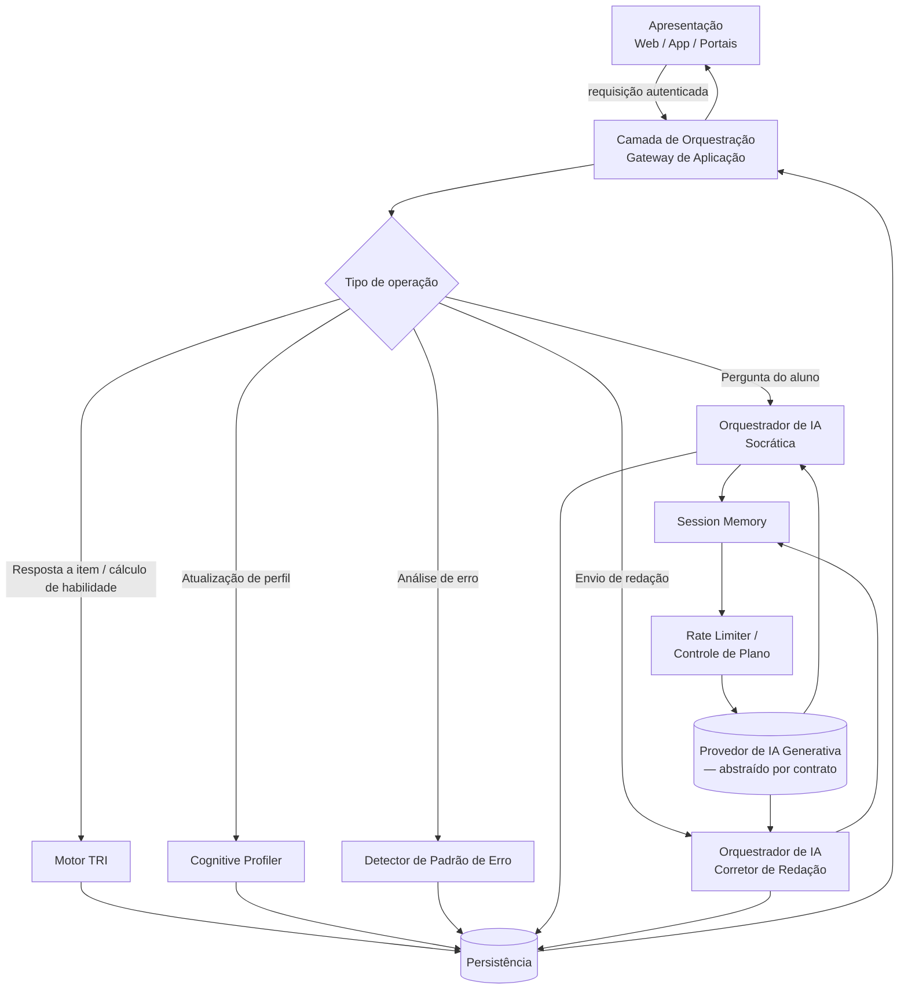
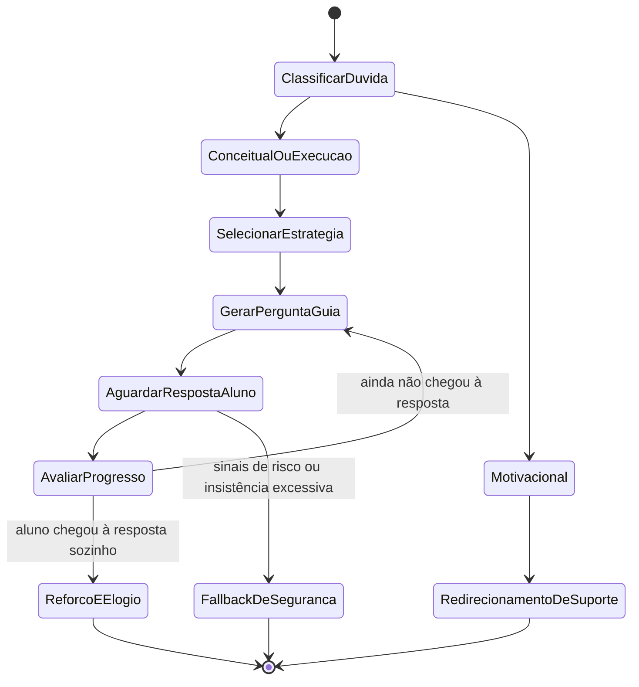
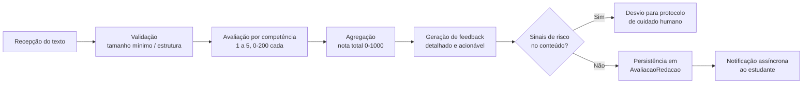

# Plataforma Nota A — Planejamento de Criação e Execução

**Documento mestre de arquitetura, backlog e integração de IA — agnóstico de stack**

> **Regra de Ouro deste documento:** nenhuma linguagem, framework, provedor de banco de dados ou API de IA específica é mencionada abaixo. Tudo está descrito em termos de **papéis, contratos e responsabilidades**, para que qualquer IA de código (ex.: Claude Code) — ou qualquer equipe — possa escolher e implementar a stack do zero a partir destas decisões conceituais.

## Como ler este documento

Este planejamento está dividido em quatro blocos, na ordem em que devem ser usados para programar a plataforma:

1. **Arquitetura Lógica e Modelagem de Dados** — o esqueleto: como os dados são organizados e como os componentes conversam entre si.
2. **Backlog Estratégico (MVP)** — o que construir primeiro, em que ordem, e por quê.
3. **Lógica de Integração das IAs** — como a IA Socrática e o Corretor de Redação se encaixam no fluxo, sem amarrar a nenhum provedor.
4. **Estratégia de Engajamento Modular** — como a gamificação é introduzida progressivamente, tela a tela.

Recomenda-se alimentar uma IA de código com este documento **seção por seção**, pedindo primeiro a definição da stack (linguagens, frameworks, banco de dados, provedores de IA) como uma decisão separada e explícita — feita por você, com critérios de custo, equipe e velocidade — e só então a implementação de cada parte aqui descrita.

---

## 1. Arquitetura Lógica e Modelagem de Dados

### 1.1 Princípios arquiteturais

A plataforma Nota A deve ser pensada em **camadas conceituais desacopladas**, comunicando-se por contratos (interfaces) bem definidos — não por acoplamento direto de código. Isso garante que qualquer camada possa ser reconstruída ou trocada sem quebrar as demais.

| Camada                                                                                          | Responsabilidade                                                                   | Não deve fazer                                                                |
| ----------------------------------------------------------------------------------------------- | ---------------------------------------------------------------------------------- | ----------------------------------------------------------------------------- |
| **Apresentação** (Web/App do estudante, Portal da Escola, Painel Admin, Landing Page)           | Renderizar interface, capturar input, exibir estado                                | Conter regras de negócio (cálculo de theta, lógica de XP, regras pedagógicas) |
| **Orquestração / Gateway de Aplicação**                                                         | Validar requisições, autenticar, rotear para o motor correto, agregar respostas    | Persistir dados diretamente sem passar pela camada de domínio                 |
| **Domínio / Motores Proprietários** (Motor TRI, Cognitive Profiler, Detector de Padrão de Erro) | Conter toda a lógica e regras de negócio pedagógicas, determinística e estatística | Conhecer detalhes de UI ou de provedor de IA generativa                       |
| **Integração de IA Generativa** (Orquestrador de Prompts, Session Memory, Rate Limiter)         | Montar contexto, chamar o provedor de IA escolhido, validar/estruturar a resposta  | Tomar decisões pedagógicas por conta própria sem dados do Domínio             |
| **Persistência**                                                                                | Armazenar e recuperar dados de forma consistente e auditável                       | Conter lógica de negócio                                                      |
| **Observabilidade e Auditoria**                                                                 | Logar uso, custos, erros, decisões automatizadas                                   | —                                                                             |

**Por que isso importa para o Nota A especificamente:** o Motor TRI e o Cognitive Profiler são **lógica determinística/estatística própria** (não são chamadas de IA generativa) — eles devem poder evoluir, ser testados e auditados independentemente de qualquer provedor de IA externo. Já a IA Socrática e o Corretor de Redação **consomem** as saídas desses motores como contexto, mas não os substituem.

### 1.2 Modelagem de dados conceitual

A seguir, as entidades centrais do domínio, agrupadas por contexto. Esta é uma modelagem **conceitual** (não amarrada a um tipo de banco específico — relacional, documento ou híbrido podem implementá-la).

**Identidade e acesso**

- `Usuario` — id, tipo de perfil (Estudante / Professor / Gestor (Escola) / Responsável / Admin), nome, e-mail, credenciais, status, criado_em.
  - _Nota (rev. 2026-06-28):_ apenas **Estudante / Professor / Escola** se auto-cadastram; **Responsável** entra por convite (`VinculoResponsavel`) e **Admin** é provisionado internamente.
- `Escola` — id, nome, rede, plano contratado.
- `Turma` — id, escola_id, professor_id, nome, período.
- `MatriculaTurma` — turma_id, estudante_id.
- `VinculoResponsavel` — responsavel_id, estudante_id, permissões de visualização.

**Perfil e personalização (núcleo da inclusão)**

- `PerfilOnboarding` — estudante_id, objetivo no ENEM, estilo de aprendizagem autodeclarado, dificuldades relatadas, rotina de estudo, autopercepção, data de conclusão. _(rev. 2026-06-28: a flag de neurodivergência foi movida para `DadoSensivelEstudante`.)_
- `DadoSensivelEstudante` _(rev. 2026-06-28)_ — estudante_id, flag opcional de neurodivergência (TDAH/dislexia/autismo), base legal/consentimento e por quem foi consentido. Entidade **isolada** com acesso mais restrito (minimização — ver 1.5), nunca exposta em relatórios agregados sem anonimização.
- `PerfilCognitivo4D` — estudante_id, posição inferida em cada um dos 4 eixos (Visual/Verbal, Analítico/Holístico, Sequencial/Aleatório, Reflexivo/Impulsivo), grau de confiança da inferência, histórico de atualizações, recomendações pedagógicas ativas.
- `AdaptacaoAtiva` — estudante_id, tipo de adaptação de interface/conteúdo aplicada (ex.: ritmo de questão, formato de explicação), origem (manual vs. inferida).

**Motor TRI e avaliação adaptativa**

- `BancoDeItens` — id, área de conhecimento, competência associada, parâmetros TRI (discriminação, dificuldade, acerto casual), enunciado, alternativas, gabarito, metadados de uso, **marcador de calibração** (`nao_calibrado` + versão de calibração) _(rev. 2026-06-28)_. Os parâmetros TRI devem ser calibrados/validados por especialista, nunca chutados.
- `HabilidadeEstudante` (theta) — estudante_id, área de conhecimento, theta atual, erro padrão de estimativa, histórico temporal de theta.
- `TentativaResposta` — id, estudante_id, item_id, resposta dada, acerto (booleano), tempo de resposta, sessão associada, timestamp.
- `SessaoAvaliativa` — id, estudante_id, tipo (quiz individual, simulado, duelo), início, fim, status.

**Detecção de padrão de erro**

- `OcorrenciaErro` — estudante_id, item_id ou competência, classificação (lacuna de conhecimento vs. deslize de atenção), evidências usadas na classificação (tempo de resposta, histórico recente, mudança de padrão), timestamp.

**Estudo aprofundado**

- `Redacao` — id, estudante_id, tema, texto enviado, data de envio, status (em correção / corrigida).
- `AvaliacaoRedacao` — redacao_id, nota e justificativa para cada uma das 5 competências oficiais (0–200 cada), nota total, feedback detalhado, **versão da rubrica usada** (`RubricaRedacao`) _(rev. 2026-06-28)_, versão do motor de correção usada, timestamp.
- `RubricaRedacao` _(rev. 2026-06-28)_ — versão, definição das 5 competências e seus níveis de pontuação, marcador de calibração. Permite reavaliar redações antigas se o critério evoluir; os valores oficiais devem ser validados por especialista.
- `ConversaSocratica` — id, estudante_id, sessão associada, histórico de mensagens (papel, conteúdo, timestamp), resumo de contexto ativo.
- `OcorrenciaRisco` _(rev. 2026-06-28)_ — estudante_id, origem (Socrática / Corretor de Redação), referência, sinal detectado, severidade, ação tomada e status de acompanhamento. Sustenta o **protocolo de cuidado humano** da seção 1.5; acesso restrito e auditado.

**Gamificação**

- `XPLedger` — estudante_id, origem do XP (quiz, redação, streak, conquista), valor, timestamp — funciona como um livro-razão auditável, nunca um contador simples sobrescrito.
- `Streak` — estudante_id, dias consecutivos, última atividade válida.
- `Conquista` (catálogo) — id, critério de desbloqueio, XP associado.
- `ConquistaConcedida` — estudante_id, conquista_id, data de concessão.
- `Duelo` — id, tipo (1v1 ou batalha coletiva entre turmas), participantes, placar, status.
- `RankingSnapshot` — escopo (turma/escola), período, posições — calculado, não fonte de verdade.

**Comercial e governança de uso de IA**

- `Plano` — id, tipo (Free / Plus / Escola), limites de uso de IA, recursos liberados.
- `Assinatura` — usuario_id ou escola_id, plano_id, status, vigência.
- `LogUsoIA` — usuario_id, tipo de integração (Socrática / Corretor de Redação), volume consumido, sucesso/falha, timestamp.
- `ContadorRateLimit` — usuario_id, janela de tempo, contagem de uso, limite aplicável.
- `LogAuditoriaAdmin` — admin_id, ação realizada, entidade afetada, timestamp.
- `PromptVersionado` _(rev. 2026-06-28)_ — integração (Socrática / Corretor de Redação), versão, conteúdo da instrução de sistema/persona, status ativo. Permite versionar, comparar qualidade e reverter prompts (ver 3.4).

### 1.3 Diagrama conceitual de relacionamento

_(Diagrama simplificado para legibilidade — ver lista completa de entidades na seção 1.2.)_

### 1.4 Fluxo de comunicação entre frontend, motores e integrações de IA

**Pontos-chave do fluxo:**

- O frontend **nunca** chama diretamente um provedor de IA ou o Motor TRI: tudo passa pela Camada de Orquestração, que aplica autenticação, autorização e validação antes.
- O Orquestrador de IA **monta o contexto** (perfil cognitivo, histórico, padrão de erro) buscando-o dos motores de domínio e da Persistência — o provedor de IA generativa nunca acessa o banco diretamente.
- O Rate Limiter e o controle de plano ficam **entre** o Orquestrador de IA e o provedor de IA, como um portão único — qualquer chamada de IA (Socrática ou Redação) passa por ele, simplificando auditoria de custo e abuso.
- A resposta da IA generativa retorna **estruturada** (não texto livre solto) para a camada de domínio, que decide o que persistir e o que repassar ao frontend.

### 1.5 Segurança, privacidade e conformidade

- **Dados sensíveis de menores e de neurodivergência** exigem base legal específica e minimização: armazenar apenas o necessário para personalização pedagógica, nunca expor esse dado em relatórios agregados sem agregação/anonimização.
- **Controle de acesso por papel (RBAC conceitual):** Estudante só acessa seus próprios dados; Responsável acessa visão simplificada do(s) filho(s) vinculado(s); Professor acessa dados agregados/individuais de sua(s) turma(s); Gestor Escolar acessa toda a escola; Admin acessa tudo, com toda ação registrada em log de auditoria.
- **Isolamento de contexto de IA por usuário:** a memória de sessão de um estudante nunca deve ser acessível ou misturada à de outro — cada `ConversaSocratica` e cada chamada ao Corretor de Redação carregam apenas o contexto daquele usuário.
- **Trilha de auditoria** obrigatória para qualquer ação no Painel Administrador (alteração de plano, acesso a dados de aluno, alteração de configuração de IA).
- **Plano de resposta a conteúdo sensível:** se o Corretor de Redação ou a IA Socrática identificarem sinais de risco (ex.: menção a autolesão) no texto do estudante, o fluxo deve **desviar para um protocolo de cuidado humano** (alerta a responsável/escola e/ou recursos de apoio), e não simplesmente seguir a correção/tutoria normalmente. Esse desvio deve ser uma regra de negócio explícita na camada de Domínio, não uma decisão deixada a critério do provedor de IA.

---

## 2. Backlog Estratégico (MVP)

### 2.1 Visão de MVP

O MVP precisa provar o **ciclo core completo**: `Onboarding → Quiz/Estudo Adaptativo → Atualização de Perfil/Dashboard`. Tudo que não sustenta diretamente esse ciclo é pós-MVP.

**Métrica norte sugerida:** _percentual de estudantes que completam o onboarding e, na mesma sessão ou na seguinte, respondem a um quiz adaptativo e visualizam uma atualização em seu Dashboard/Mapa Cognitivo._ Essa métrica valida simultaneamente onboarding, Motor TRI, Cognitive Profiler e Dashboard — o coração do produto.

### 2.2 Épicos do MVP

| Épico                                      | Objetivo                                              | Telas envolvidas                    | Depende de                       | Prioridade       |
| ------------------------------------------ | ----------------------------------------------------- | ----------------------------------- | -------------------------------- | ---------------- |
| E1 — Autenticação e Onboarding             | Cadastrar/logar e capturar perfil inicial em 8 passos | Landing, Autenticação, Onboarding   | —                                | **P0**           |
| E2 — Motor TRI e Quiz Adaptativo           | Selecionar e pontuar questões adaptativamente         | Quiz & Batalha (modo individual)    | Banco de itens calibrado, E1     | **P0**           |
| E3 — Cognitive Profiler                    | Inferir e expor o perfil 4D                           | Perfil (Mapa Cognitivo), Dashboard  | E2 (dados comportamentais)       | **P0**           |
| E4 — Dashboard Core                        | Mostrar evolução, estimativa de nota, streak          | Dashboard, App Shell                | E2, E3                           | **P0**           |
| E5 — Detector de Padrão de Erro            | Classificar erros como lacuna vs. deslize             | Feedback pós-quiz, Dashboard        | E2                               | **P1**           |
| E6 — Simulado Adaptativo                   | Avaliação mais longa, multi-área                      | Módulo Estudo > Simulado            | E2                               | **P1**           |
| E7 — Editor de Redação + Corretor de IA    | Escrever e receber nota/feedback por competência      | Módulo Estudo > Redação             | E1                               | **P1**           |
| E8 — IA Socrática                          | Chat-tutor que guia sem entregar resposta             | Módulo Estudo > Chat IA             | E3 (perfil), E5 (padrão de erro) | **P1**           |
| E9 — Gamificação Core (XP, Streak)         | Recompensar uso e consistência                        | App Shell, Dashboard                | E2                               | **P0**           |
| E10 — Conquistas e Histórico               | Reconhecer marcos, manter histórico                   | Perfil > Conquistas/Histórico       | E9                               | **P1**           |
| E11 — Portal da Escola (mínimo viável)     | Visão de turmas e desempenho para gestores            | Portal Escola (2–3 das 7 abas)      | E2, E3, E4                       | **P2**           |
| E12 — Painel Administrador (mínimo viável) | Gestão de usuários e monitoramento básico             | Painel Admin (2–3 das 7 abas)       | E1, LogUsoIA                     | **P2**           |
| E13 — Painel dos Pais                      | Visão simplificada de progresso do filho              | Perfil > Painel dos Pais            | E4, VinculoResponsavel           | **P2**           |
| E14 — Duelo PvP                            | Competição 1v1 em tempo real/assíncrono               | Quiz & Batalha (modo duelo)         | E2, E9                           | **P2 (pós-MVP)** |
| E15 — Batalhas Coletivas entre Turmas      | Engajamento social em escala de turma                 | Dashboard (coletivo), Portal Escola | E9, E11                          | **P2 (pós-MVP)** |

### 2.3 Histórias de usuário fundamentais (por épico, P0/P1)

**E1 — Autenticação e Onboarding**

- _Como visitante_, quero me cadastrar escolhendo meu perfil (Estudante, Professor, Escola), para acessar a área correta da plataforma.
  - Critérios: seleção de perfil obrigatória; validação de e-mail; redirecionamento correto pós-cadastro.
- _Como estudante novo_, quero passar por um onboarding de 8 passos (nome, objetivo, estilo de aprendizagem, dificuldades, rotina, autopercepção, neurodivergência opcional, confirmação), para que meu perfil inicial seja gerado.
  - Critérios: cada passo é salvo incrementalmente (não se perde progresso); campo de neurodivergência é opcional e claramente não-obrigatório; ao final, um `PerfilOnboarding` é criado e um `PerfilCognitivo4D` inicial (mesmo que de baixa confiança) é instanciado.
- _Como usuário_, quero recuperar minha senha de forma segura, para não perder acesso à conta.

**E2 — Motor TRI e Quiz Adaptativo**

- _Como estudante_, quero responder questões cuja dificuldade se ajusta ao meu desempenho, para que o quiz nem seja fácil demais nem impossível.
  - Critérios: a cada resposta, o theta do estudante é recalculado; a próxima questão é selecionada com base no theta atualizado e nos parâmetros do item; cada `TentativaResposta` é persistida com tempo de resposta.
- _Como estudante_, quero ver minha estimativa de nota atualizada na barra superior após responder questões, para acompanhar minha evolução em tempo real.

**E3 — Cognitive Profiler**

- _Como estudante_, quero que a plataforma identifique silenciosamente meu estilo de aprendizagem com base no meu comportamento (sem questionários extras repetitivos), para receber recomendações relevantes sem esforço extra.
  - Critérios: o perfil 4D é atualizado em background a partir de sinais comportamentais (tempo de resposta, padrão de navegação, tipo de erro); cada atualização registra grau de confiança; recomendações pedagógicas são geradas a partir da posição nos 4 eixos.

**E4 — Dashboard Core**

- _Como estudante_, quero ver minha evolução, estimativa de nota e sequência de estudos (streak) em um só lugar, para entender meu progresso.
  - Critérios: dados refletem o estado mais recente do Motor TRI e do XP Ledger; streak quebra corretamente se não houver atividade válida no dia.

**E7 — Editor de Redação + Corretor de IA**

- _Como estudante_, quero escrever uma redação dissertativo-argumentativa e receber uma nota por competência (0–200 cada), para saber exatamente onde melhorar.
  - Critérios: as 5 competências oficiais do ENEM são sempre avaliadas e exibidas separadamente; feedback é específico (cita trechos do próprio texto, não genérico); resultado é persistido em `AvaliacaoRedacao`.

**E8 — IA Socrática**

- _Como estudante_, quero tirar dúvidas em um chat que me guia até a resposta em vez de entregá-la, para realmente aprender o raciocínio.
  - Critérios: em nenhuma circunstância normal de uso a IA fornece a resposta final direta antes de pelo menos uma rodada de pergunta-guia; o chat usa o histórico da sessão atual como contexto; se o aluno insistir repetidamente em pedir a resposta direta, há uma política explícita de redirecionamento (não apenas repetição da negativa).

**E9 — Gamificação Core**

- _Como estudante_, quero ganhar XP por estudar e manter uma sequência de dias, para me sentir motivado a continuar.
  - Critérios: XP é sempre lançado no `XPLedger` (nunca sobrescrito), permitindo auditoria; streak é calculado a partir de atividade válida diária, com regra clara do que conta como "atividade válida".

### 2.4 Sequenciamento recomendado

| Fase                                   | Foco                                              | Épicos         | Lógica da ordem                                                                                     |
| -------------------------------------- | ------------------------------------------------- | -------------- | --------------------------------------------------------------------------------------------------- |
| **Fase 0 — Fundação**                  | Identidade, modelagem de dados, base do Motor TRI | E1, base de E2 | Nada funciona sem autenticação e sem o motor de seleção/cálculo de itens existir, mesmo que rústico |
| **Fase 1 — Núcleo de Aprendizagem**    | Loop principal completo                           | E2, E3, E4, E9 | Esta fase entrega o ciclo core que valida a métrica norte do MVP                                    |
| **Fase 2 — Estudo Aprofundado**        | Conteúdo de maior valor percebido                 | E5, E6, E7, E8 | Depende de E2/E3 já estarem maduros para alimentar contexto à IA Socrática e ao Detector de Erro    |
| **Fase 3 — Retenção e Reconhecimento** | Engajamento de médio prazo                        | E10, E14       | Depende de XP/Streak (E9) já estáveis                                                               |
| **Fase 4 — Institucional**             | Visão de gestores, pais e operação interna        | E11, E12, E13  | Depende de haver dados reais de uso (E2–E10) para serem exibidos com sentido                        |
| **Fase 5 — Expansão Social**           | Engajamento em escala                             | E15            | Depende da base institucional (E11) e de Duelo (E14) já validados                                   |

---

## 3. Lógica de Integração das IAs

### 3.1 Princípio de orquestração agnóstica

Nenhuma parte do produto deve "saber" qual provedor de IA generativa está por trás. Toda integração passa por um **Orquestrador de IA**, responsável por:

1. Montar um **pacote de contexto estruturado** (persona/regras fixas + dados dinâmicos do estudante + input atual).
2. Enviar esse pacote ao provedor escolhido (decisão de stack, fora deste documento).
3. Validar/estruturar a resposta recebida contra um **contrato de saída esperado** (schema).
4. Aplicar guardrails de negócio sobre a resposta antes de repassá-la ao frontend.
5. Registrar uso (para Rate Limiter e billing) e qualidade (para auditoria contínua).

Isso permite trocar de provedor de IA, ou usar múltiplos provedores em paralelo (ex.: um para Socrática, outro para Redação), sem alterar nenhuma outra camada do sistema.

### 3.2 IA Socrática — especificação estrutural

**Comportamento inegociável:** nunca entregar a resposta final diretamente em uso normal. A interação segue uma máquina de estados conceitual:

**Contexto injetado pelo Orquestrador a cada interação:**

- Pergunta/mensagem atual do estudante.
- Questão ou tema de estudo ativo (se houver).
- Posição no Perfil Cognitivo 4D (define _como_ a dica é formulada — ex.: aluno mais Visual recebe sugestão de representar visualmente; aluno mais Impulsivo recebe um convite explícito a pausar antes de responder).
- Classificação recente do Detector de Padrão de Erro relacionado ao tema (lacuna de conhecimento pede explicação de conceito; deslize de atenção pede revisão cuidadosa, não nova explicação).
- Resumo de contexto da sessão atual (não o histórico bruto ilimitado).

**Guardrails explícitos:**

- Política de redirecionamento quando o aluno insiste repetidamente em obter a resposta direta (ex.: oferecer revisão guiada de um passo mais simples, em vez de repetir a recusa).
- Escopo: perguntas fora do contexto do ENEM/estudo são redirecionadas educadamente.
- Fallback de segurança: sinais de sofrimento emocional do estudante acionam o protocolo de cuidado humano descrito na seção 1.5, e não a continuidade da tutoria normal.

### 3.3 Corretor de IA para Redações — especificação estrutural

**Pipeline conceitual:**

**Contrato de saída esperado (estrutura conceitual, não amarrada a tecnologia):**

- Para cada uma das 5 competências oficiais: nota (0–200), justificativa textual, trecho(s) do texto do aluno citados como evidência.
- Nota total (soma das 5).
- Feedback geral consolidado (pontos fortes, pontos de melhoria, sugestão de próximo passo de estudo).
- Metadados: versão do critério/motor de correção usado, timestamp — essenciais para auditoria e para poder reavaliar redações antigas se o critério evoluir.

**Guardrails explícitos:**

- A avaliação deve se basear **estritamente** nas 5 competências oficiais — nenhuma nota ou comentário sobre posicionamento político/pessoal do aluno fora desse critério.
- Saída deve ser estruturada e validável programaticamente (não um texto livre que a aplicação precise interpretar com heurísticas frágeis).
- Mesmo protocolo de desvio por sinais de risco descrito para a IA Socrática.

### 3.4 Governança de prompts e contexto

- O **pacote de contexto** de qualquer integração é montado **exclusivamente** pela camada de Orquestração — nunca pelo cliente (app/web), o que evita que o usuário manipule instruções de sistema.
- Instruções de sistema/persona de cada IA devem ser **versionadas** (auditável, testável, reversível), permitindo comparar qualidade entre versões.
- Recomenda-se amostragem humana periódica das respostas de ambas as integrações para verificar aderência aos guardrails (ex.: "a IA Socrática realmente nunca entregou a resposta direta nesta amostra?").

### 3.5 Rate Limiter e controle de custo de uso de IA

- Cada chamada a qualquer integração de IA passa por um **único portão** de controle de limite, parametrizado pelo plano do usuário (Free / Plus / Escola).
- Lógica conceitual: contagem de uso por janela de tempo, com resposta clara ao usuário ao se aproximar/atingir o limite (não um erro técnico).
- **Modo degradado:** se o limite for atingido ou o provedor de IA estiver indisponível, o produto deve ter um plano B definido por integração — ex., para a Redação, enfileirar o pedido para processamento posterior em vez de falhar; para a Socrática, oferecer dicas estáticas pré-elaboradas como ponte até a IA voltar a responder.

---

## 4. Estratégia de Engajamento Modular

### 4.1 Princípios de gamificação inclusiva

- **Progresso individual antes de comparação social:** rankings e duelos são opcionais/configuráveis — essencial dado o público neurodivergente que a Nota A quer servir, para quem comparação social pode gerar ansiedade em vez de motivação.
- **Recompensar esforço e consistência, não só acerto:** o XP e os reconhecimentos devem considerar sinais como tentativa refletida ou retorno após erro, integrando-se ao Detector de Padrão de Erro — e não apenas "respondeu certo = pontos".
- **Gamificação como reforço, nunca como pressão:** streaks devem ter mecanismos de tolerância (ex.: não punir um único dia perdido de forma desproporcional) para não criar ansiedade de desempenho.

### 4.2 Mapeamento de tela × mecânica de engajamento

| Tela / Momento              | Mecânica                                                                     | Objetivo                                 | Métrica de sucesso                          |
| --------------------------- | ---------------------------------------------------------------------------- | ---------------------------------------- | ------------------------------------------- |
| Onboarding                  | Conclusão gera um "perfil inicial revelado" (sensação de progresso imediato) | Ativação                                 | Taxa de conclusão do onboarding             |
| App Shell (barra superior)  | Estimativa de nota + uso de IA sempre visíveis                               | Consciência contínua de progresso        | Frequência de abertura do app               |
| App Shell (barra de XP)     | XP visível em toda ação relevante                                            | Reforço imediato                         | XP médio ganho por sessão                   |
| Quiz & Batalha (individual) | XP por questão respondida, com bônus por sequência de acertos refletidos     | Engajamento no loop core                 | Questões respondidas por sessão             |
| Quiz & Batalha (duelo)      | Modo PvP opcional                                                            | Engajamento competitivo (para quem opta) | Partidas por usuário/semana                 |
| Dashboard                   | Streak, marcos de evolução do theta                                          | Retenção de médio prazo                  | Streak médio; retorno em 7 dias             |
| Perfil > Conquistas         | Badges e certificados desbloqueáveis                                         | Reconhecimento e orgulho                 | Conquistas desbloqueadas; compartilhamentos |
| Perfil > Mapa Cognitivo 4D  | Visualização da própria evolução de estilo/perfil                            | Autoconhecimento, retenção emocional     | Frequência de revisita à tela               |
| Portal da Escola            | Batalhas coletivas entre turmas, ranking institucional                       | Engajamento social em escala             | Participação por turma                      |
| Painel dos Pais             | Visão simplificada de progresso (não gamificada)                             | Apoio externo ao estudante               | Frequência de acesso por responsáveis       |

### 4.3 Faseamento da introdução da gamificação

Alinhado ao sequenciamento do backlog (seção 2.4), para não sobrecarregar o MVP com mecânicas que ainda não têm dados reais para sustentar:

| Fase                        | Mecânicas introduzidas                                                                 |
| --------------------------- | -------------------------------------------------------------------------------------- |
| Fase 1 (Núcleo)             | XP por ação, Streak básico                                                             |
| Fase 2 (Estudo Aprofundado) | Reconhecimento por reflexão/recuperação de erro (ligado ao Detector de Padrão de Erro) |
| Fase 3 (Retenção)           | Conquistas, certificados, histórico visual de evolução                                 |
| Fase 4 (Institucional)      | Ranking por turma/escola, painel dos pais                                              |
| Fase 5 (Expansão Social)    | Duelo PvP, Batalhas coletivas entre turmas                                             |

---

## Anexo — Como utilizar este documento com uma IA de código

1. **Não peça a stack junto com o domínio.** Primeiro valide com a IA de código que ela entendeu as entidades (seção 1.2) e o fluxo (seção 1.4); só depois peça a ela para _propor_ opções de stack (linguagem, framework, banco, provedor de IA) com critérios explícitos (custo, curva de aprendizado da equipe, velocidade de desenvolimento, escalabilidade) — essa é uma decisão sua, separada deste planejamento.
2. **Alimente por fase, não tudo de uma vez.** Use o sequenciamento da seção 2.4 como roteiro de prompts: comece pela Fase 0/1, peça a implementação do modelo de dados e do Motor TRI básico, valide, e só então avance.
3. **Trate os guardrails da seção 3 como testes, não como sugestões.** Cada guardrail (ex.: "a IA Socrática nunca entrega a resposta direta") deveria se tornar um caso de teste automatizado ou um critério de revisão manual antes de qualquer release.
4. **Mantenha este documento como fonte da verdade de domínio.** Se, durante a implementação, a IA de código sugerir mudanças na modelagem de dados ou nas regras de negócio, atualize este documento — ele deve continuar sendo a referência conceitual independente da stack escolhida.

---

## Histórico de revisões

- **2026-06-28** — Incorporadas as reconciliações **R1–R6** levantadas no planejamento de execução (ver `docs/01-entendimento-produto.md` §9): papel padronizado para **"Gestor (Escola)"** (R1); clarificação de papéis de auto-cadastro (R2); **marcadores de calibração** em `BancoDeItens` e `AvaliacaoRedacao` (R3); novas entidades **`OcorrenciaRisco`** (R4), **`DadoSensivelEstudante`** (R5), **`PromptVersionado`** e **`RubricaRedacao`** (R6). A _Regra de Ouro_ de agnosticismo de stack permanece: todas as adições são conceituais.
