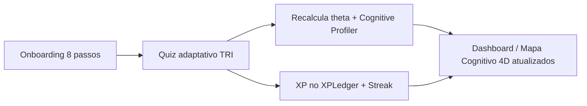

# 01 — Entendimento do Produto (Nota A)

> **Status:** validado em conversa (Passo 0).
> **Fonte da verdade:** [`NotaA_Planejamento_Criacao_Execucao.md`](../NotaA_Planejamento_Criacao_Execucao.md). Em qualquer divergência, a fonte da verdade tem precedência sobre este documento. Mudanças de modelagem ou de regra de negócio que surgirem aqui estão registradas na seção **9** para retroalimentar aquele arquivo.

---

## 1. Objetivo deste documento

Registrar, de forma acionável, o entendimento do produto que guiará todos os demais artefatos (`02`–`10`) e a implementação. Não introduz stack (ver [`02-stack-e-justificativa.md`](02-stack-e-justificativa.md)).

## 2. O que é o Nota A (resumo executivo)

Plataforma **gamificada de preparação para o ENEM com IA adaptativa**, **mobile-first**, cujo diferencial é a **personalização inclusiva** — projetada também para estudantes neurodivergentes (TDAH, dislexia, autismo). Posicionamento: _"Aprenda jogando. Evolua estudando."_ Inclusão é **princípio de arquitetura e design**, não recurso lateral.

O sistema se organiza em duas camadas de inteligência que **não se confundem**:

- **4 motores proprietários** (lógica determinística/estatística, **não** IA generativa):
  1. **Motor TRI** — calcula a habilidade do aluno (θ/theta), a probabilidade de acerto por item e faz a **seleção adaptativa** de questões.
  2. **Cognitive Profiler** — infere **silenciosamente** (a partir do comportamento) a posição do aluno em 4 eixos: Visual/Verbal, Analítico/Holístico, Sequencial/Aleatório, Reflexivo/Impulsivo; gera recomendações pedagógicas.
  3. **Detector de Padrão de Erro** — distingue **lacuna de conhecimento** de **deslize de atenção**.
  4. **Rate Limiter & Session Memory** — controla consumo de IA por plano e mantém o contexto das conversas.
- **2 integrações de IA generativa** (consomem o contexto dos motores; **nunca os substituem**):
  1. **IA Socrática** — tutor em chat que **nunca entrega a resposta direta**; guia o raciocínio usando a memória de sessão.
  2. **Corretor de Redação por IA** — avalia estritamente pelas **5 competências oficiais do ENEM** (0–200 cada, total 0–1000), com feedback detalhado **citando trechos do próprio texto do aluno**.

## 3. Pilares inegociáveis (invariantes de domínio)

Cada item desta tabela vira **critério de revisão e/ou teste automatizado** nos docs `06` e `10`.

| #   | Invariante                                                                                                                                | Onde mora a regra                  |
| --- | ----------------------------------------------------------------------------------------------------------------------------------------- | ---------------------------------- |
| I1  | O frontend **nunca** chama provedor de IA nem o Motor TRI diretamente. Tudo passa pela Orquestração.                                      | Orquestração                       |
| I2  | O **Rate Limiter é o portão único** de toda chamada de IA (Socrática e Redação).                                                          | Integração de IA                   |
| I3  | A IA Socrática **nunca entrega a resposta final direta** em uso normal (mín. 1 rodada de pergunta-guia).                                  | Integração de IA (guardrail/teste) |
| I4  | O Corretor avalia **só** pelas 5 competências oficiais; nada de juízo político/pessoal.                                                   | Integração de IA (guardrail/teste) |
| I5  | Toda saída de IA volta **estruturada** (schema validável), não texto livre.                                                               | Integração de IA + Domínio         |
| I6  | Sinais de risco (ex.: autolesão) **desviam para o protocolo de cuidado humano** — decisão do Domínio, **não** do provedor de IA.          | Domínio (doc 10)                   |
| I7  | `XPLedger` é **livro-razão append-only**; nunca um contador sobrescrito.                                                                  | Persistência                       |
| I8  | `RankingSnapshot` é **calculado**, nunca fonte de verdade.                                                                                | Persistência                       |
| I9  | **Isolamento de contexto de IA por usuário**: memória de sessão de um aluno nunca se mistura à de outro.                                  | Integração de IA                   |
| I10 | Dados de menores e de neurodivergência: **minimização + base legal + RBAC + auditoria**.                                                  | Domínio + Persistência (doc 10)    |
| I11 | Parâmetros TRI, 5 competências e regras de pontuação são **configuração versionada/calibrável** — nunca valores inventados em código.     | Domínio (TODOs de calibração)      |
| I12 | Modo degradado definido por integração quando o limite é atingido ou o provedor falha (enfileirar redação; dicas estáticas na Socrática). | Integração de IA                   |

## 4. Superfícies, papéis e planos

**Superfícies (apps):**

| Superfície             | Escopo                                                                                         | MVP?               |
| ---------------------- | ---------------------------------------------------------------------------------------------- | ------------------ |
| Landing page (pública) | Proposta de valor, planos, captura de leads                                                    | Sim                |
| Autenticação           | Cadastro/login + recuperação de senha                                                          | Sim                |
| App do Estudante       | Onboarding 8 passos → App Shell → Quiz & Batalha → Módulo Estudo → Dashboard → Perfil/Recursos | Sim (núcleo)       |
| Portal da Escola       | 7 abas (visão geral, turmas, desempenho, batalhas coletivas, relatórios, ranking…)             | Parcial (2–3 abas) |
| Painel Administrador   | 7 abas internas (usuários, escolas, planos, logs, uso de IA…)                                  | Parcial (2–3 abas) |

**Papéis (RBAC) — 5 papéis, detalhe no doc 10:** Estudante · Responsável · Professor · Gestor (Escola) · Admin.
**Planos comerciais:** Free · Plus · Escola.

## 5. Ciclo core do MVP e métrica norte

**Ciclo core:** `Onboarding (8 passos) → Quiz/Estudo adaptativo (TRI) → atualização de Perfil/Dashboard/Mapa Cognitivo 4D`.

**🎯 Métrica norte:** _percentual de estudantes que completam o onboarding e, na mesma sessão ou na seguinte, respondem a um quiz adaptativo e visualizam uma atualização no Dashboard/Mapa Cognitivo._ Valida simultaneamente Onboarding, Motor TRI, Cognitive Profiler e Dashboard. (Reforçada no doc 08.)

## 6. Faseamento (visão macro — detalhe no doc 08)

Fase 0 Fundação → Fase 1 Núcleo de Aprendizagem → Fase 2 Estudo Aprofundado → Fase 3 Retenção → Fase 4 Institucional → Fase 5 Expansão Social. (Espelha a seção 2.4 da fonte da verdade.)

## 7. Premissas adotadas

| #   | Premissa                                                                                                                                             | Racional                                                                           | Confiança | Impacto se falsa                   |
| --- | ---------------------------------------------------------------------------------------------------------------------------------------------------- | ---------------------------------------------------------------------------------- | --------- | ---------------------------------- |
| A1  | **LGPD** é a lei reitora, com camada de **consentimento parental (ECA)** para menores.                                                               | Produto BR para menores.                                                           | Alta      | Reescreve doc 10 (base legal).     |
| A2  | Auto-cadastro só para **Estudante/Professor/Escola**; **Responsável** entra por convite/`VinculoResponsavel`; **Admin** é provisionado internamente. | Tela de Autenticação lista 3 perfis; fonte trata Responsável/Admin de outra forma. | Alta      | Ajusta fluxo de Autenticação (E1). |
| A3  | "**Gestor**" (doc do prompt) = "**Escola-gestor**" (fonte). Nome canônico: **Gestor**.                                                               | Mesma entidade.                                                                    | Alta      | Renomear em docs/código.           |
| A4  | **Tempo-real (duelos)** é **pós-MVP** (E14/Fase 5); a stack não pode **impedi-lo**, mas o MVP não o constrói.                                        | Backlog da fonte.                                                                  | Alta      | Antecipar esforço de realtime.     |
| A5  | Tema **escuro é o default** da marca; tema claro acessível também é entregue.                                                                        | Diretriz visual do prompt.                                                         | Alta      | Inverte default de tema.           |
| A6  | Onboarding salva **incrementalmente** (passo a passo, sem perder progresso).                                                                         | Critério de aceite E1 + público com baixa banda.                                   | Alta      | Refaz UX do onboarding.            |
| A7  | Item bank inicial e calibração TRI **não são gerados por nós**; são **configuração calibrada por especialista** (ver Q-02).                          | Invariante I11.                                                                    | Média     | E2 fica bloqueado sem dados.       |

## 8. Perguntas em aberto / TODOs de calibração

> Itens marcados como **🔧 calibração** não devem ser "chutados": são configuração a validar com especialista.

| ID   | Pergunta / decisão                                                                                                | Bloqueia     | Decisão                                                                                                                                                           | Status                                             |
| ---- | ----------------------------------------------------------------------------------------------------------------- | ------------ | ----------------------------------------------------------------------------------------------------------------------------------------------------------------- | -------------------------------------------------- |
| Q-01 | **Protocolo de cuidado humano**: quem é o "humano do outro lado" no MVP?                                          | doc 10, I6   | ✅ Exibir **CVV/188** + escalar a Responsável/Escola quando houver vínculo + **flag interno** para revisão humana; **nunca** continuar a tutoria/correção normal. | **RESOLVIDO** (confirmado pelo dono em 2026-06-28) |
| Q-02 | **Origem do banco de itens** (provas ENEM públicas? autorais?) e **dados de calibração** dos parâmetros a/b/c. 🔧 | E2 (TRI)     | Iniciar com itens públicos + parâmetros provisórios marcados `nao_calibrado=true`; recalibrar com volume real.                                                    | ⏳ Pendente — requer especialista (psicometria)    |
| Q-03 | **Valores oficiais** das 5 competências e regras de pontuação/arredondamento. 🔧                                  | E7 (Redação) | Tratar como rubrica versionada (`rubrica_v1`) a validar com especialista; sem hard-code.                                                                          | ⏳ Pendente — requer especialista (pedagógico)     |
| Q-04 | **Provedor de IA default** e restrições (custo/DPA/residência de dados).                                          | doc 02/06    | Abstrair via porta (já implementada — `LLMProviderPort`); escolha do provedor fica **TODO** até eval custo×qualidade.                                             | ⏳ Pendente (confirmado adiamento em 2026-06-28)   |
| Q-05 | "**Atividade válida**" que conta para streak (responder N questões? minutos? concluir 1 sessão?).                 | E9           | ✅ ≥1 `SessaoAvaliativa` concluída **ou** ≥5 questões no dia; tolerância de 1 dia (freeze).                                                                       | **RESOLVIDO** (confirmado pelo dono em 2026-06-28) |
| Q-06 | **Estimativa de nota** exibida na barra superior: fórmula θ→nota ENEM. 🔧                                         | E4           | Mapeamento provisório θ→escala 0–1000 marcado como não-calibrado.                                                                                                 | ⏳ Pendente — requer especialista (psicometria)    |
| Q-07 | **Idade mínima** e fluxo de consentimento (quem assina: aluno ≥16? responsável?).                                 | doc 10       | ✅ Consentimento do responsável **obrigatório** para <18; aluno ≥16 **co-consente** (dupla camada).                                                               | **RESOLVIDO** (confirmado pelo dono em 2026-06-28) |

## 9. Propostas de ajuste à fonte da verdade (registro de mudanças)

Nada que **conflite** com a fonte. Apenas **reconciliações de nomenclatura/escopo**, **incorporadas à fonte da verdade em 2026-06-28** (ver _Histórico de revisões_ naquele arquivo):

- **R1 — Nome de papel:** padronizar "Escola-gestor" → **"Gestor"** (A3).
- **R2 — Papéis de auto-cadastro:** explicitar que só 3 perfis se auto-cadastram; Responsável/Admin têm provisionamento distinto (A2).
- **R3 — Campo `nao_calibrado`/versão de rubrica:** adicionar a `BancoDeItens` e `AvaliacaoRedacao` um marcador explícito de calibração/versão (suporta I11, Q-02, Q-03). _Proposta de modelagem — detalhada no doc 04._
- **R4 — Entidade `OcorrenciaRisco` (nova):** registrar incidentes do protocolo de cuidado humano (I6) — sinal detectado, origem (Socrática/Redação), ação tomada, status de acompanhamento. _Detalhada nos docs 04/10._
- **R5 — Entidade `DadoSensivelEstudante` (nova):** isolar a flag de neurodivergência e afins numa tabela de acesso mais restrito (minimização, I10), em vez de coluna solta em `PerfilOnboarding`. _Detalhada nos docs 04/10._
- **R6 — Entidades de versionamento `PromptVersionado` e `RubricaRedacao` (novas):** suportar prompts de sistema versionados (fonte 3.4) e a rubrica calibrável das 5 competências (Q-03/I11). _Detalhadas nos docs 04/06._

---

_Próximo:_ a stack que materializa este entendimento está em [`02-stack-e-justificativa.md`](02-stack-e-justificativa.md) (pendente da sua confirmação).
