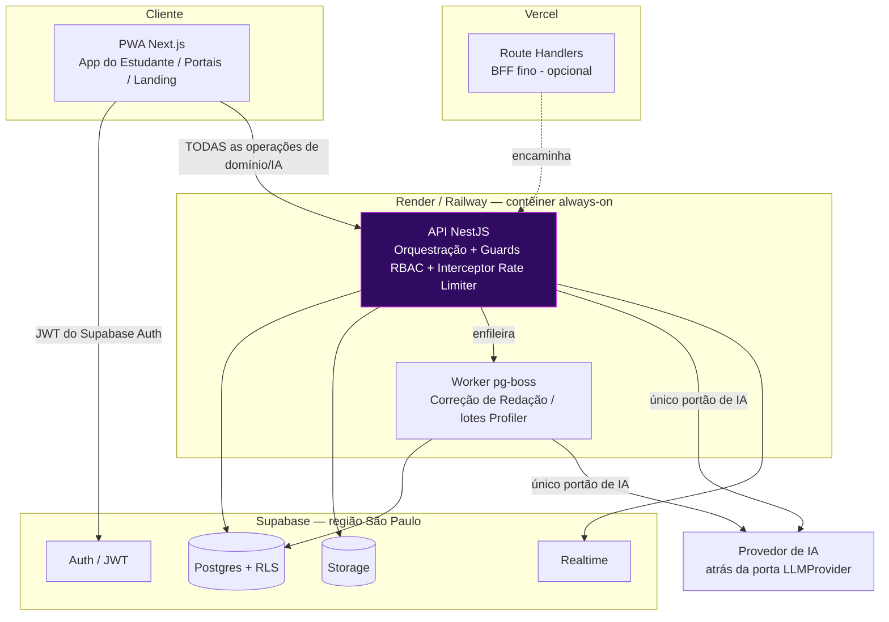
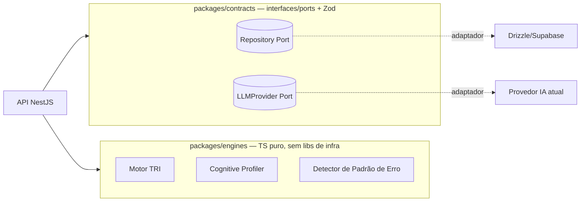

# 02 — Stack Tecnológica e Justificativa

> **✅ STATUS: CONFIRMADA ("ok stack").** Base estável para os docs `03`–`07`.
> **Sub-decisões travadas:** Host da API/Worker = **Render/Railway** · ORM = **Drizzle** · IA = **porta `LLMProvider` + default recomendado** (modelo econômico p/ Socrática, modelo de maior capacidade p/ Redação; provedor final = eval custo×qualidade no doc 06).
>
> **Direções escolhidas por você (Passo 0):** PWA mobile-first · TypeScript em tudo · BaaS gerenciado (Supabase) · provedor de IA abstraído + um default.

---

## 1. Critérios de decisão (nesta ordem de peso)

1. **Custo** — público vulnerável + plano Free → começar dentro de tiers gratuitos/baratos e escalar por uso.
2. **Velocidade para equipe pequena** — um só idioma, ferramentas com DX alta, menos infra para operar.
3. **Mobile-first** — funcionar bem em Android modesto e conexão instável.
4. **Escalabilidade sem reescrita** — trocar provedor de IA, banco ou hospedagem sem mexer no domínio.
5. **Manutenibilidade** — fronteiras claras (camadas), contratos tipados, guardrails como testes.

## 2. Stack proposta (visão de uma tabela)

| Camada / Necessidade                                                 | Escolha                                                                               | Por quê (curto)                                                                                                                   | Alternativa                              | Quando a alternativa é melhor                                                 |
| -------------------------------------------------------------------- | ------------------------------------------------------------------------------------- | --------------------------------------------------------------------------------------------------------------------------------- | ---------------------------------------- | ----------------------------------------------------------------------------- |
| **Monorepo**                                                         | pnpm workspaces + **Turborepo**                                                       | TS em tudo favorece código compartilhado (contratos, domínio); build cacheado.                                                    | Nx                                       | Se a equipe crescer muito e quiser geradores/grafo de tarefas mais ricos.     |
| **Linguagem**                                                        | **TypeScript** (estrito) ponta a ponta                                                | Decisão sua; um idioma front+back; tipos compartilhados.                                                                          | —                                        | —                                                                             |
| **Frontend / PWA**                                                   | **Next.js (App Router)** + **Serwist** (service worker)                               | SSR/SSG p/ landing (SEO + 1ª pintura rápida em aparelho fraco); instalável/offline shell; mobile-first.                           | **Vite + React + vite-plugin-pwa** (SPA) | Se dispensarmos SSR/SEO e quisermos o mínimo possível de complexidade.        |
| **UI / Design System**                                               | **Tailwind CSS** + **shadcn/ui** (Radix) + **CSS variables (design tokens)**          | Tokens da marca como variáveis (doc 07); Radix entrega acessibilidade (foco/teclado/ARIA) — requisito do público neurodivergente. | CSS Modules / Panda CSS                  | Se quiser zero utilitários e CSS mais "tradicional".                          |
| **Animação**                                                         | **Framer Motion** com `prefers-reduced-motion` respeitado + kill-switch global        | Gamificação precisa ser **desativável** (doc 07).                                                                                 | CSS transitions puras                    | Se quisermos reduzir peso de JS ao máximo.                                    |
| **Estado/Dados (cliente)**                                           | **TanStack Query** + Zustand (UI local)                                               | Cache/retry/offline-aware p/ rede ruim.                                                                                           | SWR / Redux Toolkit                      | Times já familiarizados com outra lib.                                        |
| **Validação/Contratos**                                              | **Zod** (compartilhado web↔api)                                                       | Schemas únicos validam I/O **e** a saída estruturada da IA (I5).                                                                  | Valibot / TypeBox                        | Bundle ainda menor (Valibot) no cliente.                                      |
| **API / Orquestração**                                               | **NestJS** (sobre Fastify)                                                            | Camadas explícitas: **Guards** = RBAC, **Interceptors** = portão do Rate Limiter (I2), módulos isolam orquestração do domínio.    | **Fastify "puro"** ou **Hono**           | Equipe quer overhead mínimo e topa estruturar à mão; ou deploy 100% edge.     |
| **Motores de domínio** (TRI, Profiler, Detector de Erro)             | **Pacotes TS puros** (`packages/engines`), **sem** dependência de framework/DB/IA     | Mantém o domínio **desacoplado e testável** (porta/adaptador). Trocar Nest/Supabase/IA não toca o domínio.                        | Microserviço Python p/ TRI               | Se a calibração estatística exigir SciPy/`catsim` (ver §6 e Q-02).            |
| **Banco de dados**                                                   | **Supabase Postgres** + **RLS** (defense-in-depth)                                    | Relacional encaixa nas entidades; RLS reforça isolamento por papel; região **sa-east-1 (São Paulo)** p/ LGPD/latência.            | Postgres autogerido / Neon / PlanetScale | Requisito institucional de infra própria, ou serverless DB com branching.     |
| **ORM / Query**                                                      | **Drizzle ORM**                                                                       | SQL-first com tipos; controle fino p/ **ledger append-only**, índices parciais e `CHECK` constraints (I7).                        | **Prisma**                               | Time prioriza DX de migrations/Studio acima de controle de SQL.               |
| **Autenticação**                                                     | **Supabase Auth** (e-mail/senha + recuperação)                                        | Já incluso; JWT com papel em `app_metadata`; resolve o "chato" da segurança.                                                      | Auth.js (NextAuth) / Clerk               | Precisar de SSO institucional pesado (Clerk) ou auto-hospedar tudo (Auth.js). |
| **Storage**                                                          | **Supabase Storage**                                                                  | Textos/arquivos de redação e assets, com policies por papel.                                                                      | S3/R2                                    | Volume grande de mídia com CDN dedicada e custo otimizado.                    |
| **Tempo-real (duelos, pós-MVP)**                                     | **Supabase Realtime** (broadcast/presence)                                            | Já incluso; **não constrói no MVP**, mas não impede (A4).                                                                         | Socket.IO dedicado                       | Lógica de duelo ficar pesada/autoritativa no servidor.                        |
| **Fila / Jobs assíncronos** (correção de redação, lotes do Profiler) | **pg-boss** (fila no próprio Postgres)                                                | **Zero infra extra** e custo zero adicional; correção de redação é longa e não cabe em function serverless curta.                 | **BullMQ + Redis (Upstash)**             | Throughput alto, agendamento avançado, muitos workers.                        |
| **Provedor de IA generativa**                                        | **Porta `LLMProvider`** (adaptador trocável) + **1 default**                          | Decisão sua; sem lock-in; permite multi-provedor depois. Default e modelo por integração = **calibração custo×qualidade** (Q-04). | Multi-provedor desde já                  | Se já houver contrato/limite fixo de um provedor.                             |
| **Hospedagem — Web**                                                 | **Vercel**                                                                            | DX nativa de Next.js, CDN global, tier inicial barato.                                                                            | Cloudflare Pages / Netlify               | Custo em escala alta de banda, ou preferência por CF.                         |
| **Hospedagem — API + Worker**                                        | **Render** (ou Railway/Fly.io) — contêiner always-on                                  | API e worker (pg-boss) precisam de processo longo (≠ serverless curto).                                                           | VPS único com Docker Compose             | Orçamento mínimo absoluto / controle total.                                   |
| **Observabilidade**                                                  | **Sentry** (erros) + **pino** (logs estruturados) + tabelas `LogUsoIA`/`LogAuditoria` | Erros, custo de IA e trilha de auditoria (doc 10).                                                                                | OpenTelemetry + Grafana                  | Necessidade de tracing distribuído detalhado.                                 |
| **Testes**                                                           | **Vitest** (unit; **guardrails como testes**) + **Playwright** (e2e do ciclo core)    | I3/I4/I6/I7 viram casos de teste.                                                                                                 | Jest + Cypress                           | Preferência da equipe.                                                        |
| **CI/CD**                                                            | **GitHub Actions**                                                                    | Padrão, gratuito p/ repos pequenos; lint+typecheck+test+deploy.                                                                   | GitLab CI                                | Se o repositório for GitLab.                                                  |
| **i18n**                                                             | pt-BR padrão via `next-intl` (estrutura pronta)                                       | Public BR; deixa porta aberta sem custo agora.                                                                                    | —                                        | —                                                                             |

## 3. Topologia de implantação (como as peças se conectam)

**Fronteira que preserva os invariantes (I1, I2, I9):**

- O cliente usa o **Supabase Auth** apenas para obter o **JWT**. **Toda** operação de domínio/IA vai para a **API NestJS** — o cliente **não** usa a API de dados do Supabase para nada que envolva motores ou IA.
- O acesso ao Postgres para lógica de negócio é **exclusivo da API/Worker** (service role). O **RLS** fica ligado como segunda barreira (defense-in-depth), não como porta principal.
- O **provedor de IA** só é alcançado por API/Worker, **sempre** atravessando o Rate Limiter (portão único). O provedor **nunca** toca o banco.

## 4. Como o domínio fica desacoplado da stack (portas & adaptadores)

- **Motores** não importam Nest, Drizzle nem SDK de IA — recebem dados via parâmetros e devolvem resultados puros. → testáveis em isolamento, auditáveis, portáveis (inclusive para Python depois, se preciso).
- **Trocar Supabase→outro Postgres** = novo adaptador de `Repository Port`.
- **Trocar/adicionar provedor de IA** = novo adaptador de `LLMProvider Port`. Nenhuma regra pedagógica muda.

## 5. Postura de custo (alinhada ao público Free)

| Item                | Início (baixo volume)                                                                                               | Escala                                            |
| ------------------- | ------------------------------------------------------------------------------------------------------------------- | ------------------------------------------------- |
| Supabase            | Free/Pro inicial (Postgres+Auth+Storage+Realtime juntos)                                                            | Sobe por uso; sem trocar de tecnologia.           |
| Vercel              | Hobby/Pro                                                                                                           | Banda é o custo dominante; CDN ajuda.             |
| API+Worker (Render) | Instância pequena always-on (barata)                                                                                | Escala horizontal por contêiner.                  |
| Fila                | **pg-boss = R$0 extra** (usa o Postgres existente)                                                                  | Migrar p/ Redis só se o throughput exigir.        |
| IA                  | Maior custo variável; **controlado pelo Rate Limiter por plano** e por modelo econômico na Socrática (alto volume). | Modelo mais caro reservado à Redação (qualidade). |

**Princípio:** começar com o **mínimo de serviços pagos distintos** (Supabase + 1 host de API + IA por uso) e crescer por consumo, sem migração de arquitetura.

## 6. Riscos, trade-offs e pontos a confirmar

- **TS para o Motor TRI:** o ecossistema estatístico do JS é mais pobre que o do Python. Mitigação: motores como **pacote puro** isolado atrás de uma porta → se a calibração (Q-02) exigir SciPy/`catsim`, extraímos **só o TRI** para um microserviço Python **sem tocar o resto**. (Confirmar tolerância a isso.)
- **Provedor de IA default (Q-04):** ainda **não fixado**. Recomendação: modelo **econômico** para a Socrática (alto volume, turnos curtos) e modelo de **maior capacidade** para a Redação (precisão importa), ambos atrás da porta; escolha final por **eval custo×qualidade** + **DPA/região (LGPD)**. ⚠️ A **detecção de risco (I6) é lógica nossa** (regras + classificador), **não** delegada ao provedor.
- **Dois hosts (Vercel + Render):** leve custo de operar dois lugares. Alternativa de simplificação: **tudo em um VPS com Docker Compose** (mais barato, mais ops) — diga se prefere.
- **Realtime de duelos:** Supabase Realtime cobre o caso, mas se o duelo exigir lógica **autoritativa** no servidor (anti-trapaça), pode pedir um serviço WS dedicado depois (A4).

## 7. Decisões — RESOLVIDAS

| #   | Decisão               | Resultado                                                                                                    |
| --- | --------------------- | ------------------------------------------------------------------------------------------------------------ |
| 1   | Stack base            | ✅ Confirmada ("ok stack").                                                                                  |
| 2   | Provedor de IA (Q-04) | Abstrair via porta + **default recomendado por integração**; provedor final = eval custo×qualidade (doc 06). |
| 3   | Host da API/Worker    | **Render/Railway** (always-on).                                                                              |
| 4   | ORM                   | **Drizzle**.                                                                                                 |

> Trocas futuras de provedor de IA, banco ou host **não** exigem reescrever o domínio (ver §4). Revisitar quando houver dados reais de custo/uso.
