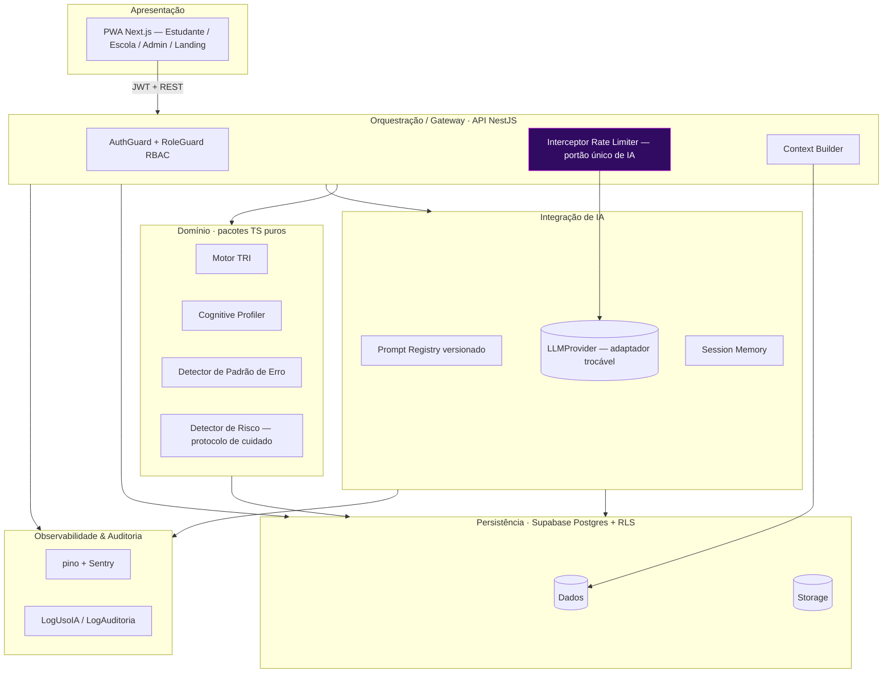
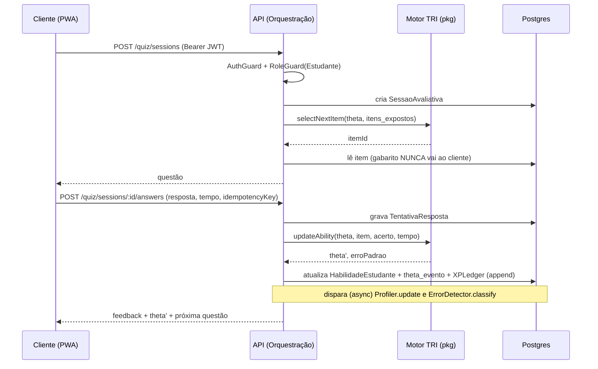
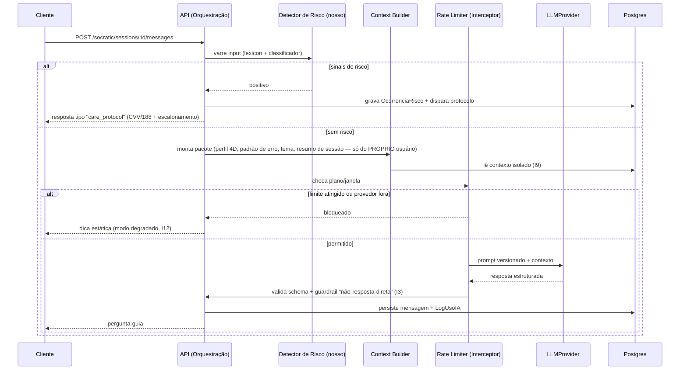

# 03 — Arquitetura

> Materializa os **12 invariantes** do [doc 01](01-entendimento-produto.md) na stack confirmada no [doc 02](02-stack-e-justificativa.md). Fonte de domínio: seção 1 do [planejamento](../NotaA_Planejamento_Criacao_Execucao.md).

---

## 1. Camadas (visão geral)



**Regra estrutural central:** a Apresentação só conhece a **Orquestração**. Nunca importa motores, nunca fala com o provedor de IA, nunca toca o banco para lógica de negócio (I1).

## 2. Responsabilidades por camada (× implementação)

| Camada                        | Responsabilidade                                                                   | Não deve fazer                           | Implementação                                          |
| ----------------------------- | ---------------------------------------------------------------------------------- | ---------------------------------------- | ------------------------------------------------------ |
| **Apresentação**              | Renderizar, capturar input, exibir estado                                          | Regras de negócio (theta, XP, pedagogia) | Next.js (PWA), Tailwind/shadcn, TanStack Query         |
| **Orquestração**              | AuthN/AuthZ, validar, rotear ao motor certo, agregar, aplicar portão de IA         | Persistir sem passar pelo domínio        | NestJS: Guards, Interceptors, Pipes (Zod)              |
| **Domínio / Motores**         | Toda regra pedagógica determinística/estatística                                   | Conhecer UI ou provedor de IA            | `packages/engines` (TS puro, sem libs de infra)        |
| **Integração de IA**          | Montar contexto, chamar provedor, validar saída, aplicar guardrails, registrar uso | Decidir pedagogia sozinha                | `ai/` no NestJS + `LLMProvider` port + Prompt Registry |
| **Persistência**              | Guardar/recuperar de forma consistente e auditável                                 | Conter regra de negócio                  | Supabase Postgres + RLS, Drizzle, Storage              |
| **Observabilidade/Auditoria** | Logar uso, custo, erros, decisões automatizadas                                    | —                                        | pino, Sentry, tabelas `log_*`                          |

## 3. Fluxos críticos

### 3.1 Quiz adaptativo (TRI) — sem IA generativa



### 3.2 IA Socrática — portão único + protocolo de cuidado



### 3.3 Correção de redação — assíncrona (fila)

```mermaid
sequenceDiagram
    participant C as Cliente
    participant API as API
    participant Q as Fila pg-boss
    participant W as Worker
    participant RISK as Detector de Risco
    participant RL as Rate Limiter
    participant LLM as LLMProvider
    participant DB as Postgres
    C->>API: POST /redacoes (texto, tema)
    API->>DB: cria Redacao (status=em_correcao)
    API->>Q: enfileira job
    API-->>C: 202 Accepted (id, status)
    W->>Q: consome job
    W->>RISK: varre texto (antes de qualquer correção)
    alt risco
        W->>DB: OcorrenciaRisco + protocolo; NÃO segue correção normal
    else
        W->>W: valida tamanho/estrutura
        W->>RL: checa plano/janela
        RL->>LLM: avaliação 5 competências (prompt + rubrica versionados)
        LLM-->>W: saída estruturada
        W->>W: valida schema + guardrail "só 5 competências" (I4)
        W->>DB: grava AvaliacaoRedacao + LogUsoIA
        W-->>C: notificação assíncrona (Realtime/push)
    end
```

## 4. O portão único de IA (I2)

Toda chamada de IA — Socrática **ou** Redação, vinda da API **ou** do Worker — passa pela **mesma cadeia**, implementada como Interceptor NestJS reutilizado pelo Worker:

```
input → [Detector de Risco] → [Context Builder] → [Rate Limiter (plano/janela)] → [LLMProvider] → [Validação de schema (Zod)] → [Guardrails de negócio] → [LogUsoIA] → output
```

- **Nenhum** caminho alternativo chega ao `LLMProvider`. Há **um único** módulo `ai/` que expõe o provedor; o resto do código não importa o SDK.
- O **Rate Limiter** é parametrizado por `Plano` (Free/Plus/Escola). Ao atingir o limite, responde com **mensagem de negócio** (não erro técnico) → `429` estruturado.

## 5. Como a arquitetura garante cada invariante

| Invariante                     | Mecanismo arquitetural                                                                       |
| ------------------------------ | -------------------------------------------------------------------------------------------- |
| I1 (frontend não chama IA/TRI) | Cliente só fala REST com a API; motores são pacotes server-side; SDK de IA isolado em `ai/`. |
| I2 (portão único)              | Interceptor único na cadeia de IA, compartilhado por API e Worker.                           |
| I3 (nunca resposta direta)     | Guardrail pós-resposta + máquina de estados (doc 06) + teste automatizado.                   |
| I4 (só 5 competências)         | Schema de saída fixo + validação + teste (doc 06).                                           |
| I5 (saída estruturada)         | Zod valida toda resposta de IA antes de persistir/repassar; repair→degrade se inválida.      |
| I6 (protocolo de cuidado)      | `Detector de Risco` (nosso) roda **antes** do provedor e **independe** dele.                 |
| I7 (XP append-only)            | Tabela sem UPDATE/DELETE (regra + permissões + revisão); saldo via agregação (doc 04).       |
| I8 (ranking calculado)         | `RankingSnapshot` é materialização; fonte é XP/θ.                                            |
| I9 (isolamento de contexto)    | Context Builder filtra por `usuario_id`; RLS como 2ª barreira.                               |
| I10 (dados sensíveis)          | `DadoSensivelEstudante` isolado + RBAC + RLS + auditoria.                                    |
| I11 (calibração)               | Parâmetros TRI/rubrica em tabelas versionadas, nunca em código.                              |
| I12 (modo degradado)           | Fila para redação; dicas estáticas para Socrática; circuit breaker no `LLMProvider`.         |

## 6. Organização lógica de módulos (árvore completa no doc 09)

- **`apps/web`** — PWA (Apresentação).
- **`apps/api`** — NestJS (Orquestração). Módulos de feature: `auth`, `onboarding`, `quiz`, `profiler`, `dashboard`, `redacao`, `socratic`, `gamificacao`, `escola`, `admin`. Módulo transversal **`ai`** (context-builder, rate-limiter, prompt-registry, risk-detector, adaptadores `LLMProvider`). Comuns: guards, interceptors, filtros.
- **`apps/worker`** — consumidores pg-boss (correção de redação, lotes do Profiler). Reusa `ai` e `engines`.
- **`packages/engines`** — `tri`, `profiler`, `error-detector` (TS puro, testável, sem infra).
- **`packages/contracts`** — schemas Zod + DTOs + **ports** (`RepositoryPort`, `LLMProviderPort`).
- **`packages/db`** — schema Drizzle, migrations, repositórios (adaptadores da `RepositoryPort`).
- **`packages/ui`** — design system (doc 07). **`packages/prompts`** — prompts versionados.

## 7. Erros, resiliência e modo degradado

- **Envelope de erro** único `{ error: { code, message, details } }` (doc 05).
- **Limite de IA** = resposta de negócio (`429` + corpo claro), nunca stack trace.
- **Circuit breaker** em volta do `LLMProvider`; ao abrir → Socrática usa dicas estáticas, Redação permanece enfileirada com retry/backoff.
- **Idempotência** em submissão de resposta de quiz (`idempotencyKey`) e em jobs (dedupe por `redacao_id`).
- **Migrations versionadas** (Drizzle) + seeds de catálogo (planos, conquistas, rubrica).

## 8. Observabilidade e auditoria (transversal)

- **`correlationId`** por requisição, propagado a logs/jobs/chamadas de IA.
- **pino** (estruturado) + **Sentry** (erros/perf).
- **`LogUsoIA`** (custo/volume/sucesso por integração) e **`LogAuditoria`** (toda ação de Admin/acesso a dado de aluno) — doc 10.
- **Amostragem humana** periódica das saídas de IA p/ aderência aos guardrails (fonte 3.4).

## 9. Segurança transversal (resumo — detalhe no doc 10)

- AuthN via **Supabase Auth** (JWT, papel em `app_metadata`); a API valida o JWT em todo request.
- **RBAC** aplicado em **Guards** (rota) + **RLS** no Postgres (dado) = defense-in-depth.
- **Isolamento de contexto de IA** garantido no Context Builder (I9).
- **Trilha de auditoria** obrigatória no Painel Admin.
