# 04 — Modelo de Dados

> Esquema concreto (PostgreSQL/Drizzle) derivado das entidades conceituais da seção 1.2 do [planejamento](../NotaA_Planejamento_Criacao_Execucao.md). Convenções abaixo, depois ER, entidades por contexto, e decisões de índice/integridade.

---

## 0. Convenções

- **PK:** `id uuid` default **uuid v7** (ordenável por tempo → bom para índices/paginação).
- **Tempo:** `timestamptz` (UTC). `criado_em`/`atualizado_em` em toda tabela mutável.
- **Nomes:** `snake_case`, tabelas no singular.
- **Soft delete** só onde há requisito legal; senão, delete real + auditoria.
- **Enums** como tipos Postgres (`CREATE TYPE`).
- **RLS** habilitado em todas as tabelas de dados de estudante (políticas no doc 10). Apps de domínio acessam via **service role** pela API; RLS é 2ª barreira.
- **Marcadores de calibração** (I11): `nao_calibrado boolean`, `versao_*` onde aplicável — nunca valores oficiais chutados.

## 1. Diagrama ER (visão de relacionamentos)

```mermaid
erDiagram
    USUARIO ||--o| PERFIL_ONBOARDING : possui
    USUARIO ||--o| DADO_SENSIVEL_ESTUDANTE : possui
    USUARIO ||--o| PERFIL_COGNITIVO_4D : possui
    USUARIO ||--o{ PERFIL_COGNITIVO_EVENTO : historico
    USUARIO ||--o{ ADAPTACAO_ATIVA : aplica
    USUARIO ||--o{ HABILIDADE_ESTUDANTE : acumula
    USUARIO ||--o{ THETA_EVENTO : registra
    USUARIO ||--o{ SESSAO_AVALIATIVA : inicia
    SESSAO_AVALIATIVA ||--o{ TENTATIVA_RESPOSTA : agrupa
    BANCO_DE_ITENS ||--o{ TENTATIVA_RESPOSTA : referenciado_por
    USUARIO ||--o{ OCORRENCIA_ERRO : apresenta
    USUARIO ||--o{ REDACAO : envia
    TEMA_REDACAO ||--o{ REDACAO : tema_de
    REDACAO ||--|| AVALIACAO_REDACAO : gera
    AVALIACAO_REDACAO ||--o{ AVALIACAO_COMPETENCIA : detalha
    RUBRICA_REDACAO ||--o{ AVALIACAO_REDACAO : versiona
    USUARIO ||--o{ CONVERSA_SOCRATICA : participa
    CONVERSA_SOCRATICA ||--o{ MENSAGEM_SOCRATICA : contem
    USUARIO ||--o{ OCORRENCIA_RISCO : aciona
    USUARIO ||--o{ XP_LEDGER : recebe
    USUARIO ||--o| STREAK : mantem
    CONQUISTA ||--o{ CONQUISTA_CONCEDIDA : concedida_em
    USUARIO ||--o{ CONQUISTA_CONCEDIDA : desbloqueia
    DUELO ||--o{ DUELO_PARTICIPANTE : tem
    USUARIO ||--o{ DUELO_PARTICIPANTE : joga
    ESCOLA ||--o{ TURMA : organiza
    TURMA ||--o{ MATRICULA_TURMA : possui
    USUARIO ||--o{ MATRICULA_TURMA : matriculado
    USUARIO ||--o{ VINCULO_RESPONSAVEL : responsavel
    USUARIO ||--o{ VINCULO_RESPONSAVEL : estudante
    PLANO ||--o{ ASSINATURA : define
    USUARIO ||--o{ ASSINATURA : assina
    ESCOLA ||--o{ ASSINATURA : assina
    USUARIO ||--o{ LOG_USO_IA : consome
    USUARIO ||--o{ CONTADOR_RATE_LIMIT : limitado
    USUARIO ||--o{ LOG_AUDITORIA_ADMIN : executa
    PROMPT_VERSIONADO ||--o{ LOG_USO_IA : usado_em
```

## 2. Identidade e acesso

**`usuario`**

- `id` uuid **PK** · `tipo_perfil` enum(`estudante`,`professor`,`gestor`,`responsavel`,`admin`) NOT NULL · `nome` text · `email` citext **UNIQUE** NOT NULL · `auth_uid` uuid UNIQUE (id do Supabase Auth) · `status` enum(`ativo`,`suspenso`,`pendente`) default `pendente` · `escola_id` uuid FK→escola NULL · `criado_em`/`atualizado_em`.
- **Nota:** senha/credenciais **não** ficam aqui — moram no Supabase Auth. Idx: `email`, `escola_id`, `tipo_perfil`.

**`escola`** — `id` PK · `nome` · `rede` text NULL · `criado_em`. (Plano via `assinatura`.)

**`turma`** — `id` PK · `escola_id` FK NOT NULL · `professor_id` FK→usuario NULL · `nome` · `periodo` text · UQ(`escola_id`,`nome`,`periodo`).

**`matricula_turma`** — `turma_id` FK · `estudante_id` FK→usuario · **PK composta**(`turma_id`,`estudante_id`) · `criado_em`. CK: estudante tem `tipo_perfil='estudante'` (validado em app + trigger).

**`vinculo_responsavel`** — `responsavel_id` FK→usuario · `estudante_id` FK→usuario · `permissoes` jsonb (escopo de visualização) · `status` enum(`pendente`,`ativo`,`revogado`) · **PK**(`responsavel_id`,`estudante_id`).

## 3. Perfil e personalização (núcleo da inclusão)

**`perfil_onboarding`** — `id` PK · `estudante_id` FK **UNIQUE** · `objetivo_enem` text · `estilo_aprendizagem_autodeclarado` jsonb · `dificuldades` jsonb · `rotina_estudo` jsonb · `autopercepcao` jsonb · `passo_atual` int (salvamento incremental, A6) · `concluido_em` timestamptz NULL · `criado_em`/`atualizado_em`.

**`dado_sensivel_estudante`** _(NEW — R5/I10; acesso mais restrito)_ — `estudante_id` FK **PK** · `neurodivergencia` jsonb NULL (ex.: `{tdah:true, dislexia:false, ...}`, opcional) · `consentimento_base_legal` text · `consentido_por` uuid (responsável/aluno) · `consentido_em` timestamptz · `criado_em`/`atualizado_em`. **RLS estrita** + coluna criptografável; nunca em relatórios agregados sem anonimização.

**`perfil_cognitivo_4d`** — `estudante_id` FK **PK** · `eixo_visual_verbal` numeric(4,3) [-1..1] · `eixo_analitico_holistico` numeric(4,3) · `eixo_sequencial_aleatorio` numeric(4,3) · `eixo_reflexivo_impulsivo` numeric(4,3) · `confianca` numeric(4,3) [0..1] · `recomendacoes_ativas` jsonb · `atualizado_em`. CK: eixos ∈ [-1,1], confianca ∈ [0,1].

**`perfil_cognitivo_evento`** _(append-only histórico)_ — `id` PK · `estudante_id` FK · `snapshot` jsonb (4 eixos + confiança) · `motivo` text · `criado_em`. Idx(`estudante_id`,`criado_em`).

**`adaptacao_ativa`** — `id` PK · `estudante_id` FK · `tipo` text (ex.: `ritmo_questao`,`formato_explicacao`) · `parametros` jsonb · `origem` enum(`manual`,`inferida`) · `ativa` boolean · `criado_em`. Idx(`estudante_id`,`ativa`).

## 4. Motor TRI e avaliação adaptativa

**`banco_de_itens`** — `id` PK · `area_conhecimento` enum(`linguagens`,`humanas`,`natureza`,`matematica`) · `competencia` text · `param_a` numeric (discriminação) · `param_b` numeric (dificuldade) · `param_c` numeric (acerto casual) · `enunciado` text · `alternativas` jsonb · `gabarito` text · `metadados_uso` jsonb · **`nao_calibrado` boolean default true** (R3/I11) · `versao_calibracao` text · `ativo` boolean · `criado_em`. Idx(`area_conhecimento`,`competencia`), idx parcial `WHERE ativo`. CK: `param_c` ∈ [0,1].

**`habilidade_estudante`** (theta atual) — `estudante_id` FK · `area_conhecimento` enum · `theta` numeric · `erro_padrao` numeric · `atualizado_em` · **PK**(`estudante_id`,`area_conhecimento`).

**`theta_evento`** _(append-only histórico de theta)_ — `id` PK · `estudante_id` FK · `area_conhecimento` · `theta` · `erro_padrao` · `tentativa_id` FK NULL · `criado_em`. Idx(`estudante_id`,`area_conhecimento`,`criado_em`).

**`sessao_avaliativa`** — `id` PK · `estudante_id` FK · `tipo` enum(`quiz`,`simulado`,`duelo`) · `iniciado_em` · `finalizado_em` NULL · `status` enum(`em_andamento`,`concluida`,`abandonada`). Idx(`estudante_id`,`iniciado_em`).

**`tentativa_resposta`** — `id` PK · `estudante_id` FK · `item_id` FK→banco_de_itens · `sessao_id` FK · `resposta` text · `acerto` boolean · `tempo_resposta_ms` int · `idempotency_key` text UNIQUE · `criado_em`. Idx(`estudante_id`,`criado_em`), idx(`sessao_id`), idx(`item_id`).

## 5. Detecção de padrão de erro

**`ocorrencia_erro`** — `id` PK · `estudante_id` FK · `item_id` FK NULL · `competencia` text NULL · `classificacao` enum(`lacuna_conhecimento`,`deslize_atencao`) · `evidencias` jsonb (tempo, histórico recente, mudança de padrão) · `confianca` numeric · `criado_em`. Idx(`estudante_id`,`criado_em`).

## 6. Estudo aprofundado

**`tema_redacao`** _(catálogo)_ — `id` PK · `titulo` · `texto_motivador` text · `ativo` boolean · `criado_em`.

**`redacao`** — `id` PK · `estudante_id` FK · `tema_id` FK→tema_redacao NULL · `tema_livre` text NULL · `texto` text · `status` enum(`em_correcao`,`corrigida`,`falha`,`bloqueada_protocolo`) · `enviado_em`. Idx(`estudante_id`,`enviado_em`).

**`rubrica_redacao`** _(NEW — R6/Q-03; versionada)_ — `id` PK · `versao` text UNIQUE (ex.: `rubrica_v1`) · `definicao` jsonb (descrição das 5 competências e níveis) · **`nao_calibrado` boolean default true** · `criado_em`.

**`avaliacao_redacao`** — `id` PK · `redacao_id` FK **UNIQUE** · `nota_total` int [0..1000] · `feedback_geral` jsonb (`pontosFortes`,`pontosMelhoria`,`proximoPasso`) · `rubrica_id` FK→rubrica_redacao · `motor_versao` text · `modelo_versao` text · `criado_em`. CK: `nota_total` ∈ [0,1000].

**`avaliacao_competencia`** — `id` PK · `avaliacao_id` FK · `competencia` int [1..5] · `nota` int [0..200] · `justificativa` text · `citacoes` jsonb (`[{trecho,inicio,fim,comentario}]`) · UQ(`avaliacao_id`,`competencia`). CK: `nota` ∈ [0,200].

**`conversa_socratica`** — `id` PK · `estudante_id` FK · `sessao_id` FK NULL · `tema_ativo` text NULL · `resumo_contexto` text (não histórico bruto ilimitado) · `criado_em`/`atualizado_em`. Idx(`estudante_id`).

**`mensagem_socratica`** — `id` PK · `conversa_id` FK · `papel` enum(`estudante`,`tutor`,`sistema`) · `conteudo` text · `estado_maquina` text NULL (nó da máquina, doc 06) · `criado_em`. Idx(`conversa_id`,`criado_em`).

**`ocorrencia_risco`** _(NEW — R4/I6)_ — `id` PK · `estudante_id` FK · `origem` enum(`socratica`,`redacao`) · `referencia_id` uuid (conversa/redação) · `sinal` text · `severidade` enum(`baixa`,`media`,`alta`) · `acao_tomada` jsonb · `status_acompanhamento` enum(`aberto`,`em_acompanhamento`,`encerrado`) · `criado_em`. Idx(`status_acompanhamento`,`criado_em`). **Acesso restrito** (doc 10).

## 7. Gamificação

**`xp_ledger`** _(append-only — I7)_ — `id` PK · `estudante_id` FK · `origem` enum(`quiz`,`redacao`,`streak`,`conquista`,`duelo`,`reflexao_erro`) · `referencia_id` uuid NULL · `valor` int · `criado_em`. **Sem UPDATE/DELETE** (regra + permissões + revisão). CK: `valor <> 0`. Idx(`estudante_id`,`criado_em`). Saldo via `SUM(valor)`; opcional **view materializada** `xp_saldo`.

**`streak`** — `estudante_id` FK **PK** · `dias_consecutivos` int · `ultima_atividade_valida` date · `freezes_disponiveis` int (tolerância, gamificação inclusiva) · `atualizado_em`. _"Atividade válida" = Q-05 (config)._

**`conquista`** _(catálogo)_ — `id` PK · `codigo` text UNIQUE · `criterio` jsonb · `xp_associado` int · `ativo` boolean.

**`conquista_concedida`** — `estudante_id` FK · `conquista_id` FK · `concedido_em` · **PK**(`estudante_id`,`conquista_id`) (idempotente — não concede 2×).

**`duelo`** _(pós-MVP)_ — `id` PK · `tipo` enum(`1v1`,`coletiva_turma`) · `status` enum(`aguardando`,`em_andamento`,`encerrado`) · `placar` jsonb · `criado_em`.

**`duelo_participante`** — `duelo_id` FK · `participante_id` uuid (usuario ou turma) · `pontos` int · **PK**(`duelo_id`,`participante_id`).

**`ranking_snapshot`** _(calculado — I8)_ — `id` PK · `escopo` enum(`turma`,`escola`) · `escopo_id` uuid · `periodo` text · `posicoes` jsonb · `gerado_em`. Idx(`escopo`,`escopo_id`,`periodo`).

## 8. Comercial e governança de uso de IA

**`plano`** _(catálogo)_ — `id` PK · `tipo` enum(`free`,`plus`,`escola`) UNIQUE · `limites_ia` jsonb (ex.: `{socratica_dia:N, redacoes_mes:M}`) · `recursos` jsonb · `ativo` boolean.

**`assinatura`** — `id` PK · `usuario_id` FK NULL · `escola_id` FK NULL · `plano_id` FK · `status` enum(`ativa`,`inadimplente`,`cancelada`) · `vigencia_inicio`/`vigencia_fim`. CK: exatamente um de (`usuario_id`,`escola_id`) preenchido. Idx(`usuario_id`),(`escola_id`).

**`log_uso_ia`** — `id` PK · `usuario_id` FK · `integracao` enum(`socratica`,`redacao`) · `prompt_versao_id` FK→prompt_versionado NULL · `tokens_in`/`tokens_out` int · `custo_estimado` numeric · `sucesso` boolean · `latencia_ms` int · `correlation_id` text · `criado_em`. Idx(`usuario_id`,`criado_em`),(`integracao`,`criado_em`).

**`contador_rate_limit`** — `usuario_id` FK · `integracao` enum · `janela_inicio` timestamptz · `contagem` int · `limite` int · **PK**(`usuario_id`,`integracao`,`janela_inicio`).

**`log_auditoria_admin`** — `id` PK · `admin_id` FK · `acao` text · `entidade` text · `entidade_id` uuid NULL · `diff` jsonb NULL · `criado_em`. Idx(`admin_id`,`criado_em`),(`entidade`,`entidade_id`).

**`prompt_versionado`** _(NEW — R6; fonte 3.4)_ — `id` PK · `integracao` enum(`socratica`,`redacao`) · `versao` text · `conteudo` text · `ativo` boolean · `criado_em`. UQ(`integracao`,`versao`). _(Conteúdo também vive em `packages/prompts` versionado em git; esta tabela referencia a versão ativa em produção.)_

## 9. Decisões de índice e integridade (resumo)

| Tema                    | Decisão                                                                                                                                                                |
| ----------------------- | ---------------------------------------------------------------------------------------------------------------------------------------------------------------------- |
| **Append-only (I7)**    | `xp_ledger`, `theta_evento`, `perfil_cognitivo_evento`, logs: sem UPDATE/DELETE; saldo/estado por agregação ou view materializada.                                     |
| **Idempotência**        | `tentativa_resposta.idempotency_key` UNIQUE; `conquista_concedida` PK composta; jobs dedupe por `redacao_id`.                                                          |
| **Unicidade de perfil** | `perfil_onboarding`, `perfil_cognitivo_4d`, `dado_sensivel_estudante`, `streak`: 1 por estudante (PK/UQ por `estudante_id`).                                           |
| **Faixas válidas (CK)** | nota competência [0..200], nota_total [0..1000], theta eixos [-1..1], confiança [0..1], `param_c` [0..1], `xp.valor ≠ 0`.                                              |
| **Hot paths (idx)**     | `tentativa_resposta(estudante_id,criado_em)`, `banco_de_itens(area,competencia) WHERE ativo`, `xp_ledger(estudante_id,criado_em)`, `log_uso_ia(usuario_id,criado_em)`. |
| **Calibração (I11)**    | `nao_calibrado`/`versao_*` em `banco_de_itens` e `rubrica_redacao`; nada oficial hard-coded.                                                                           |
| **Privacidade (I10)**   | `dado_sensivel_estudante` e `ocorrencia_risco` com RLS estrita + acesso auditado (doc 10).                                                                             |
| **FKs**                 | `ON DELETE RESTRICT` por padrão; `CASCADE` só em filhos de agregados (ex.: `mensagem_socratica`→`conversa_socratica`).                                                 |

> **Calibração pendente:** parâmetros TRI (Q-02), níveis da rubrica (Q-03) e mapa θ→nota (Q-06) entram como **dados versionados**, validados por especialista — nunca inventados aqui.
