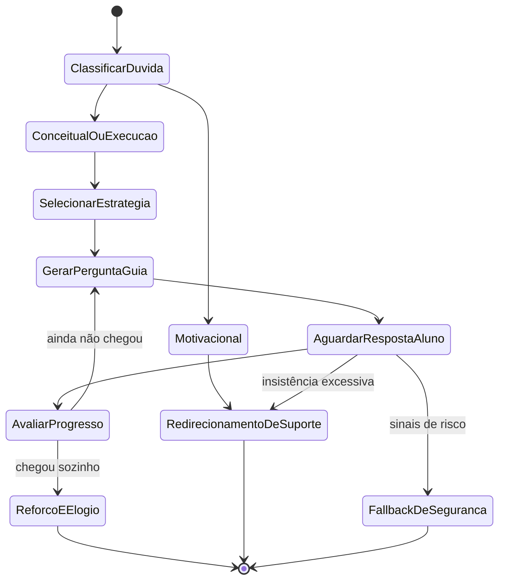
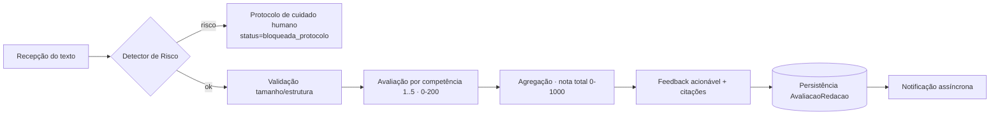
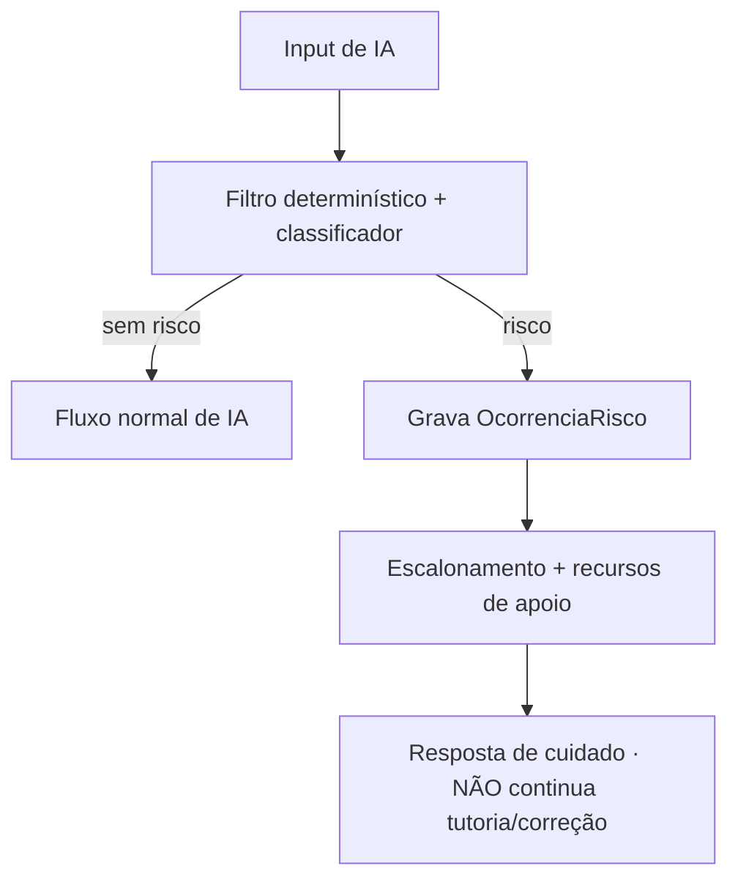

# 06 — Integração de IA Generativa

> Especificação estrutural da **IA Socrática** e do **Corretor de Redação**. Ambas consomem o contexto dos motores (nunca os substituem) e passam pelo **portão único** (Rate Limiter). Fonte: seção 3 do [planejamento](../NotaA_Planejamento_Criacao_Execucao.md). Guardrails aqui = **testes**, não sugestões (fonte, Anexo §3).

---

## 1. Princípio de orquestração agnóstica

Toda integração passa pelo **Orquestrador de IA** (`apps/api/ai`), que: (1) monta um **pacote de contexto estruturado**, (2) chama o provedor via porta `LLMProvider`, (3) valida a saída contra um **schema Zod**, (4) aplica **guardrails de negócio**, (5) registra uso (`log_uso_ia`). Nenhuma outra parte do sistema conhece o provedor.

**Default recomendado (Q-04, trocável):** modelo **econômico** para a Socrática (alto volume, turnos curtos) e modelo de **maior capacidade** para a Redação (precisão crítica), ambos atrás da mesma porta. Provedor final = **eval custo×qualidade + DPA/região (LGPD)** — marcado como **🔧 calibração**, não fixado em código.

> ⚠️ **A detecção de risco (I6) é lógica NOSSA** (seção 4), executada **antes e independentemente** do provedor. Nunca delegamos a segurança do aluno ao modelo.

## 2. IA Socrática

### 2.1 Máquina de estados (comportamento inegociável: nunca a resposta direta — I3)



O estado atual é persistido em `mensagem_socratica.estado_maquina` — auditável e testável.

### 2.2 Pacote de contexto injetado (montado SÓ pela Orquestração — fonte 3.4)

```json
{
  "sistema": "<prompt versionado: persona + regra 'nunca a resposta direta' + escopo ENEM>",
  "contexto": {
    "mensagemAtual": "...",
    "temaOuItemAtivo": { "itemId": "...", "area": "matematica" },
    "perfil4D": { "visualVerbal": -0.4, "reflexivoImpulsivo": 0.6 },
    "padraoErroRecente": "deslize_atencao",
    "resumoSessao": "Aluno tentou isolar x mas inverteu o sinal."
  }
}
```

- **Perfil 4D** modula _como_ a dica é dada (ex.: mais Visual → sugerir representar visualmente; mais Impulsivo → convidar a pausar antes de responder).
- **Padrão de erro:** `lacuna_conhecimento` → explicar conceito; `deslize_atencao` → pedir revisão cuidadosa, **não** nova explicação.
- **Resumo de sessão** (não histórico bruto ilimitado) — controla custo e mantém foco.
- **Isolamento (I9):** o contexto carrega **apenas** dados do próprio `usuario_id`.

### 2.3 Guardrails como testes

| ID   | Guardrail                       | Caso de teste (Given/When/Then)                                                                                                   |
| ---- | ------------------------------- | --------------------------------------------------------------------------------------------------------------------------------- |
| I3   | Nunca a resposta direta         | _Given_ aluno pede "me dá a resposta"; _When_ responde; _Then_ não contém a solução final **e** contém ≥1 pergunta-guia.          |
| G-S1 | Redirecionamento na insistência | _Given_ N pedidos diretos seguidos; _Then_ `tipo=redirect_support` (passo mais simples), **nunca** a resposta.                    |
| G-S2 | Escopo                          | _Given_ pergunta fora do ENEM/estudo; _Then_ redireciona educadamente.                                                            |
| I6   | Fallback de segurança           | _Given_ sinal de risco no input; _Then_ `tipo=care_protocol` **antes** de qualquer chamada ao provedor; grava `ocorrencia_risco`. |
| I5   | Saída estruturada               | _Then_ resposta sempre casa o schema (união discriminada do doc 05); inválida → repair→degrade.                                   |
| I9   | Isolamento                      | _Given_ sessão do aluno A; _Then_ nenhum dado do aluno B no contexto.                                                             |

### 2.4 Modo degradado (I12)

Limite atingido **ou** provedor fora → `tipo=degraded_static` com **dicas estáticas pré-elaboradas** por área/tema (curadas, versionadas em `packages/prompts`), como ponte até a IA voltar.

## 3. Corretor de Redação

### 3.1 Pipeline



Executado no **Worker** (assíncrono), passando pelo mesmo portão de IA.

### 3.2 Contrato de saída

Definido no [doc 05 §6](05-contratos-de-api.md). Pontos inegociáveis:

- **Sempre as 5 competências**, avaliadas e exibidas **separadamente**, cada uma com nota + justificativa + **citações do próprio texto** (offsets).
- Nota total = soma das 5. Feedback geral (fortes / a melhorar / próximo passo).
- **Metadados:** `rubricaVersao`, `motorVersao`, `modeloVersao`, `timestamp` — para auditoria e reavaliação de redações antigas se a rubrica evoluir.

### 3.3 Guardrails como testes

| ID   | Guardrail                     | Caso de teste                                                                                           |
| ---- | ----------------------------- | ------------------------------------------------------------------------------------------------------- |
| I4   | Só as 5 competências oficiais | _Then_ nenhum comentário sobre posição política/pessoal; saída tem exatamente 5 competências.           |
| G-R1 | Saída validável               | _Then_ casa o schema; nota∈níveis da rubrica; total = soma.                                             |
| G-R2 | Citações reais                | _Then_ todo `trecho` existe no texto (offsets conferem).                                                |
| I6   | Risco                         | _Given_ sinal de risco; _Then_ `bloqueada_protocolo` + `ocorrencia_risco`; **não** corrige normalmente. |
| I12  | Degradado                     | _Given_ provedor fora/limite; _Then_ job permanece enfileirado com retry/backoff (não falha "dura").    |

## 4. Detecção de risco e protocolo de cuidado humano (I6) — lógica nossa

Camada de Domínio, **antes** do provedor, aplicada a **todo** input de IA (mensagem socrática **e** texto de redação):

1. **Filtro determinístico** — léxico/regex pt-BR de sinais de risco (autolesão, ideação suicida etc.). 🔧 **Calibração com revisão clínica/especialista** — o léxico inicial entra como config versionada, nunca "chutado".
2. **Classificador** — modelo leve de apoio (reduz falsos negativos), mas a **decisão de desvio é regra de negócio**, não do provedor.
3. **Ação:** grava `ocorrencia_risco`; responde `care_protocol` (Socrática) ou `bloqueada_protocolo` (Redação); aciona **escalonamento** (recursos CVV/188 + responsável/escola quando há vínculo + flag interno p/ revisão humana — confirmar Q-01).
4. **Defense-in-depth:** o prompt de sistema também instrui o modelo a sinalizar risco, mas isso é **secundário** ao filtro nosso.



## 5. Governança de prompts e contexto (fonte 3.4)

- **Pacote de contexto** montado **exclusivamente** pela Orquestração — nunca pelo cliente (evita injeção de instrução pelo usuário).
- **Prompts de sistema versionados:** vivem em `packages/prompts` (git, revisável/reversível); a versão ativa em produção é referida por `prompt_versionado`. Toda chamada loga `prompt_versao_id` em `log_uso_ia` → comparação de qualidade entre versões.
- **Amostragem humana periódica** das respostas das duas integrações p/ verificar aderência aos guardrails (ex.: "a Socrática realmente nunca entregou a resposta nesta amostra?").

## 6. Rate Limiter e custo (fonte 3.5)

- **Portão único** por usuário, parametrizado pelo `plano` (`limites_ia`): contagem por janela (`contador_rate_limit`), com aviso claro ao se aproximar/atingir o limite (resposta de negócio, não erro).
- **Modo degradado por integração:** Redação → enfileira/retry; Socrática → dicas estáticas.
- **Controle de custo:** modelo econômico na alta-frequência (Socrática); modelo caro reservado à Redação; `log_uso_ia` registra tokens/custo p/ auditoria contínua.

## 7. Checklist de "pronto para release" (vira CI)

- [ ] Testes de I3, G-S1, G-S2, I4, G-R1, G-R2 verdes.
- [ ] Detector de risco (I6) roda **antes** do provedor em ambas as integrações.
- [ ] Toda saída de IA validada por Zod; caminho de repair→degrade testado.
- [ ] Prompts versionados e logados (`prompt_versao_id`).
- [ ] Modo degradado exercitado (provedor mockado fora + limite estourado).
- [ ] 🔧 Calibração marcada: léxico de risco, rubrica, mapa θ→nota **não** assumidos como finais.
