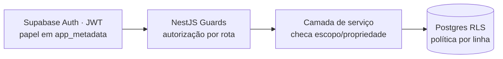
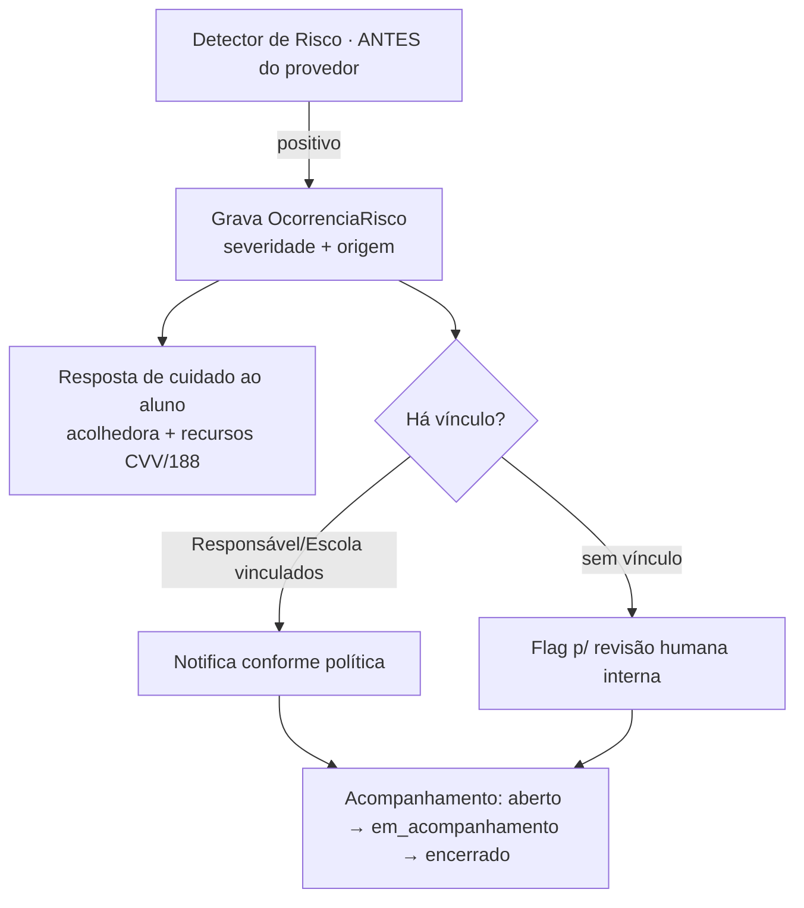

# 10 — Segurança & Privacidade

> RBAC por papel, dados de menores e de neurodivergência, isolamento de contexto de IA, trilha de auditoria e o **protocolo de cuidado humano**. Aplica a seção 1.5 do [planejamento](../NotaA_Planejamento_Criacao_Execucao.md) à stack do doc 02. Lei reitora: **LGPD** + **ECA** (consentimento parental) — premissa A1.

---

## 1. Papéis e matriz RBAC

5 papéis: **Estudante · Responsável · Professor · Gestor (Escola) · Admin**.

| Recurso / Ação                                     | Estudante                              | Responsável                           | Professor                                                   | Gestor                      | Admin                       |
| -------------------------------------------------- | -------------------------------------- | ------------------------------------- | ----------------------------------------------------------- | --------------------------- | --------------------------- |
| Próprios dados de estudo (θ, tentativas, redações) | CRUD próprio                           | —                                     | —                                                           | —                           | leitura auditada            |
| Dados de **filho vinculado** (visão simplificada)  | —                                      | leitura (escopo `VinculoResponsavel`) | —                                                           | —                           | leitura auditada            |
| **Dado sensível** (neurodivergência)               | leitura/edição própria + consentimento | leitura se titular do consentimento   | **não** (só adaptação derivada, não o diagnóstico)          | **não**                     | acesso restrito + auditado  |
| Dados **agregados** da turma                       | —                                      | —                                     | leitura (suas turmas)                                       | leitura (toda escola)       | leitura                     |
| Dado **individual** de aluno da turma              | —                                      | —                                     | leitura pedagógica (sua turma), **sem** dado sensível bruto | conforme política da escola | auditado                    |
| Config de planos / IA                              | —                                      | —                                     | —                                                           | —                           | CRUD (auditado)             |
| `OcorrenciaRisco`                                  | —                                      | notificação conforme protocolo        | conforme protocolo                                          | conforme protocolo          | leitura restrita + auditada |

**Princípio:** menor privilégio. Estudante só acessa o próprio; Responsável só o vínculo; Professor/Gestor só **agregado** por padrão, nunca dado sensível bruto; Admin tudo, **sempre logado**.

## 2. Onde o RBAC é imposto (defense-in-depth)



1. **JWT** carrega `papel` (e `escola_id`/vínculos) em `app_metadata` (imutável pelo cliente).
2. **Guards** (rota) barram papéis não autorizados (`FORBIDDEN_ROLE`).
3. **Serviço** valida **propriedade/escopo** (ex.: este θ é do `usuario_id` do token? esta turma é deste professor?).
4. **RLS** no Postgres = última barreira: mesmo um bug na app não vaza linha de outro usuário.

**Exemplo de política RLS (conceitual):**

```sql
-- tentativa_resposta: estudante só vê as próprias
create policy p_tentativa_own on tentativa_resposta
  for select using (estudante_id = auth_current_user_id());
-- dado_sensivel_estudante: titular OU consentidor; nunca professor/gestor
create policy p_sensivel on dado_sensivel_estudante
  for all using (estudante_id = auth_current_user_id()
              or estudante_id in (select estudante_id from vinculo_responsavel
                                  where responsavel_id = auth_current_user_id() and status='ativo'));
```

> A API de domínio usa **service role** (contorna RLS) mas aplica autorização nas camadas 2–3; RLS protege acessos diretos e erros. Chave service role nunca vai ao cliente.

## 3. Dados de menores e de neurodivergência (LGPD/ECA)

- **Base legal + consentimento parental:** cadastro de <18 exige consentimento do responsável (ECA); registrar base legal, quem consentiu e quando (em `DadoSensivelEstudante`). **Q-07 resolvido (2026-06-28):** consentimento do responsável **obrigatório** para <18; aluno **≥16 co-consente** (dupla camada) — campos `consentimento_base_legal`/`consentido_por`/`consentido_em` já suportam isso.
- **Minimização:** coletar só o necessário para personalização. Neurodivergência é **opcional** no onboarding (H1.2) e isolada em `DadoSensivelEstudante` (não em `PerfilOnboarding`).
- **Isolamento + cifragem:** `DadoSensivelEstudante` com RLS estrita; coluna sensível **criptografável** em repouso; acesso sempre auditado.
- **Nunca em agregados sem anonimização:** relatórios de escola/turma não expõem flag de neurodivergência nem permitem reidentificação (k-anonimato mínimo a definir).
- **Derivado, não diagnóstico:** Professor/Gestor veem **adaptações pedagógicas** sugeridas, nunca o rótulo clínico bruto.
- **Direitos do titular (LGPD):** acesso, correção, portabilidade e **eliminação** — endpoints/admin para atender (retenção definida por política, com base legal para o que precisa permanecer).

## 4. Isolamento de contexto de IA (I9)

- O **Context Builder** monta o pacote de IA filtrando **estritamente** por `usuario_id`; memória de sessão de um aluno **nunca** se mistura à de outro.
- O **provedor de IA nunca acessa o banco**; recebe só o pacote montado. Acordo de processamento de dados (**DPA**) com o provedor + opção de **não-treinamento** nos dados + preferência de região (LGPD) — parte da escolha do provedor (Q-04/doc 06).
- Prompt de sistema montado **só** no servidor (cliente não injeta instrução).

## 5. Trilha de auditoria

- **Toda** ação do Painel Admin e **todo** acesso a dado de aluno por papel elevado → `LogAuditoriaAdmin` (admin_id, ação, entidade, diff, timestamp), **append-only**.
- `LogUsoIA` registra cada chamada de IA (integração, prompt versão, tokens, custo, sucesso, latência, `correlation_id`) — auditoria de custo/abuso e qualidade.
- Logs imutáveis (sem UPDATE/DELETE); retenção e exportação para o admin.

## 6. Protocolo de cuidado humano (I6) — regra de negócio, não do provedor

Acionado quando o **Detector de Risco** (lógica nossa, doc 06 §4) identifica sinais de risco (ex.: autolesão) em mensagem da Socrática **ou** texto de redação — **antes** de qualquer correção/tutoria normal.



**Decisão confirmada (Q-01, resolvido pelo dono em 2026-06-28):**

1. **Sempre** exibir resposta acolhedora + recursos de apoio (**CVV 188**, https://cvv.org.br) — nunca seguir a correção/tutoria como se nada fosse.
2. **Escalonar** a responsável/escola **quando houver vínculo** e conforme política de privacidade aceita (cuidado para não expor o aluno indevidamente — equilíbrio LGPD × dever de cuidado).
3. **Flag interno** para revisão humana (`OcorrenciaRisco.status_acompanhamento`).
4. **Quem vê `OcorrenciaRisco`:** acesso restrito (papéis definidos com a escola/jurídico), sempre auditado.

> ⚠️ "A quem notificar" já está decidido (acima). Ainda pendente de **especialista clínico** antes do release das Fases 2+: o **limiar de severidade** e o **léxico de detecção** em si (doc 06 §4) — marcados 🔧, não inventados aqui.

## 7. Segurança de aplicação (transversal)

- **Transporte:** HTTPS/TLS em tudo; HSTS.
- **AuthZ em toda rota** (default deny); rotas públicas explicitamente marcadas.
- **Validação de entrada** por Zod (anti-injeção/abuso); rate limit também em rotas sensíveis de auth.
- **Headers** de segurança (CSP, X-Content-Type-Options, etc.) no `web`.
- **Segredos** fora do código (env validada); rotação de chaves; service role só no servidor.
- **Dependências** com varredura no CI; **Sentry** para anomalias.

## 8. Checklist de conformidade (gate de release)

- [ ] RBAC por rota (Guards) **e** RLS por tabela testados (G-CI-3).
- [ ] `DadoSensivelEstudante` isolado, cifrável, fora de agregados.
- [ ] Consentimento parental registrado para <18 (Q-07 resolvido).
- [ ] Isolamento de contexto de IA verificado (I9) + DPA do provedor assinado.
- [ ] Auditoria append-only ativa (Admin + acesso a dado de aluno).
- [ ] Protocolo de cuidado: detector roda **antes** do provedor; `OcorrenciaRisco` + escalonamento testados (Q-01 confirmado).
- [ ] Direitos LGPD (acesso/correção/eliminação) atendíveis.
